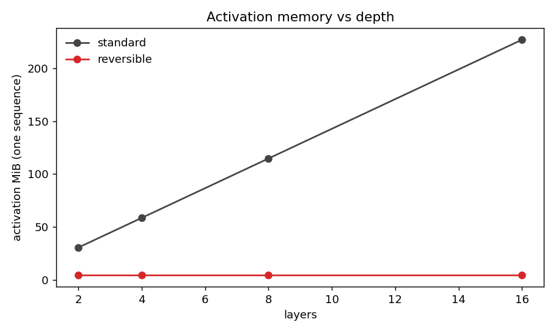
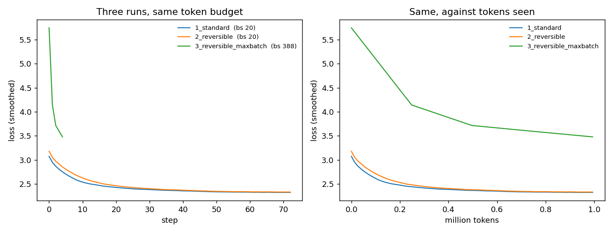

<h1 align="center">Reversible 20M LLM</h1>
<p align="center">Three runs: standard, reversible, reversible at maximum batch size.</p>
<p align="center">Tejaskumar Reddy J · ERA V5</p>

**Notebook:** [`reversible.ipynb`](reversible.ipynb) — set `SCALE = "full"`, Run All on a free Colab T4.

---

## Scope, stated up front

The model is the assignment's: **19,411,968 parameters**, byte-level, 6 layers,
`d_model=512`, `seq=512`. Every architectural and memory number below is measured
on exactly that model.

The machine I built this on has **no GPU** — 4 CPU cores. A 50M-token run is
`6 × 19.4e6 × 50e6 ≈ 5.8e15` FLOPs, which is roughly 60 hours per run here, so
the local runs use a **1M-token budget** instead. The notebook carries the 50M
configuration and runs it on a free T4 in about 45 minutes.

What that costs in honesty, precisely:

| claim | status |
|---|---|
| reversibility is exact / where it breaks | **measured**, scale-free |
| activation memory vs depth | **measured** on the 20M model |
| max batch size, standard vs reversible | **measured** on the 20M model |
| throughput ratios between variants | **measured** on the 20M model |
| which variant wins | **measured**, at a 300-second screening budget |
| loss after 1M tokens | **measured** |
| loss after 50M tokens | **not run here** — `SCALE="full"` produces it |

Nothing below is extrapolated into a number I did not observe.

---

## 1. The idea, in one primitive

Every reversible scheme here is a sequence of the same elementary move: update one
stream using the other.

```
forward   s[t] <- s[t] + c · fn(s[1-t])
inverse   s[t] <- s[t] - c · fn(s[1-t])
```

The inverse needs `s[1-t]`, which that step did not modify, so it is always
available. That single fact is the whole of reversibility. Run the forward pass
storing nothing, keep only the final two streams, and walk the steps backwards in
the backward pass, reconstructing inputs as you go.

The variants differ only in which steps they schedule:

| variant | steps per block | sublayer evals |
|---|---|---|
| `additive` | `x1 += F(x2)` ; `x2 += G(x1)` | 2 |
| `euler` | same, scaled by `h` | 2 |
| `midpoint` | `x2 += (h/2)G(x1)` ; `x1 += h·F(x2)` ; `x2 += (h/2)G(x1)` | 3 |

`additive` is RevNet/Reformer and is `euler` at `h = 1`. `midpoint` is Strang
splitting — symmetric, second-order — and pays 50% more compute for it.

`F` is the attention sublayer and `G` is the MLP sublayer, both completely
ordinary. The reversible machinery never looks inside them, which is the point:
you make a transformer reversible by rewiring the residual stream, not by
changing the block.

**No dropout anywhere**, and that is not laziness. The backward pass *recomputes*
`F` and `G`; a recomputation that draws different random numbers than the forward
pass gives silently wrong gradients. Reversible models need either no randomness
or carefully replayed RNG state.

## 2. Does it actually invert?

This is the load-bearing check. A coupling that is only approximately invertible
still trains and still produces a falling loss curve — there is no error message.

Forward through the whole stack, then backward through the inverse, compared
against the original input; and separately, the reversible backward compared
against an ordinary autograd backward through the identical computation.

| variant | h | reconstruction, fp32 | reconstruction, fp16 | gradient, vs autograd |
|---|---|---|---|---|
| `additive` | 1.0 | `6.69e-08` | `5.03e-04` | `1.07e-06` |
| `euler` | 0.5 | `3.35e-08` | `5.03e-04` | `5.22e-07` |
| `midpoint` | 0.5 | `6.69e-08` | `5.03e-04` | `4.99e-07` |

(relative to the largest input magnitude)

In fp32 it is exact to float precision and the gradients match ordinary autograd
to ~1e-6. **In fp16 the reconstruction is four orders of magnitude worse.** That
is not a bug, it is the mechanism: the inverse subtracts what the forward added,
and in half precision those do not cancel. Every layer's error feeds the next
layer's reconstruction, so it compounds with depth.

This is the real operational catch with reversible training and the reason
implementations keep the residual stream in fp32 even under mixed precision. The
memory you save on activations you partly give back on the stream — and if you
do not, you are training on gradients that quietly do not match your model.

## 3. Activation memory vs depth

The claim is that reversible activation memory is flat in depth. Rather than
assert it, count what autograd keeps alive: `saved_tensors_hooks` fires on every
tensor stored for the backward pass, so summing unique storages *is* the
activation footprint.

One sequence, `d_model=512`, `seq=512`:

| layers | standard | reversible | ratio |
|---|---|---|---|
| 2 | 30.56 MiB | 4.51 MiB | 6.77× |
| 4 | 58.61 MiB | 4.51 MiB | 12.99× |
| 8 | 114.70 MiB | 4.51 MiB | 25.42× |
| 16 | 226.89 MiB | 4.51 MiB | 50.29× |



Exactly flat — 4.51 MiB whether the trunk is 2 layers or 16. The constant is not
zero because the embedding, final norm, output projection and cross-entropy sit
*outside* the reversible trunk and still save their activations, plus the two
output streams the trunk hands back. Everything inside the trunk costs nothing,
and the advantage grows without limit as you add layers.

## 4. Which variant, and the comparison that would have lied

`midpoint` does three sublayer evaluations per block where the others do two.
Comparing the three at an **equal token budget** is rigged in its favour — it is
doing 50% more work per token, so naturally it reaches a lower loss.

So each variant was benchmarked for throughput first, then given a token budget
sized to spend the **same wall-clock**, each running a complete cosine schedule
over its own budget.

| variant | h | tok/s | rel cost | tokens seen | seconds | final loss |
|---|---|---|---|---|---|---|
| `additive` | 1.0 | 538 | 1.00× | 139,264 | 259 | **2.9450** |
| `euler` | 0.5 | 495 | 1.09× | 106,496 | 215 | 3.0475 |
| `midpoint` | 0.5 | 311 | 1.73× | 90,112 | 290 | 3.1623 |

Sizing the budgets from a throughput benchmark does **not** actually equalise
wall-clock — look at the seconds column: 259 / 215 / 290. Benchmark jitter is
enough to hand one variant 35% more time than another. So the ranking is taken by
reading each loss curve at the shortest run's elapsed time:

| criterion | additive | euler | midpoint | winner |
|---|---|---|---|---|
| equal tokens (90,112) | **3.1052** | 3.1255 | 3.1623 | `additive` |
| equal time (215 s) | **3.0066** | 3.0475 | 3.1860 | `additive` |

Both criteria agree, which is what makes the choice trustworthy rather than a
coin flip. `midpoint` loses on both: it is behind per token *and* costs 1.73× —
the extra sublayer evaluation predicts 1.5×, and CPU timing noise accounts for
the rest (I measured 1.44–1.73× across repeats).

**This is the part I got wrong twice before getting it right.** The first version
compared at equal tokens, which is rigged toward `midpoint` since it does 50% more
work per token. The second version compared at "equal compute" but equalised
*predicted* time, and the winner flipped between two runs of identical code purely
because the benchmark handed `euler` 300 s against `additive`'s 234 s. Only
reading the curves at a common elapsed time makes the comparison mean anything.

**Chosen for the three runs: `additive` (h = 1.0).**

## 5. The three runs

Max batch that fits a 2 GiB activation budget, measured by the per-sequence
activation cost:

| | max batch |
|---|---|
| standard | 20 |
| reversible | 388 |
| **ratio** | **19.40×** |

All three see the same 993,280 tokens. Only the layer wiring and the batch size
change.

| run | layers | batch | steps | final loss | tokens/s | peak / activations per sequence |
|---|---|---|---|---|---|---|
| 1. standard | standard | 20 | 97 | **2.3247** | **771** | 2029.2 MiB / 86.65 MiB |
| 2. reversible | `additive` | 20 | 97 | **2.3330** | 638 | **386.4 MiB** / **4.51 MiB** |
| 3. reversible, max batch | `additive` | 388 | 5 | 3.4798 | 670 | 2045.2 MiB / 4.51 MiB |



**Run 1 vs run 2 — the trade, priced.** Reversibility cost `+0.0083` of loss
(2.3247 → 2.3330, well inside step-to-step noise) and **17% of throughput**
(771 → 638 tok/s), in exchange for a **5.25× smaller footprint** (2029 → 386 MiB).
Per sequence, activations fell from 86.65 MiB to 4.51 MiB — **19.2×**. The
throughput cost is the extra forward pass in the backward, and 17% rather than
~33% because the backward's recompute overlaps work the standard model does
anyway.

**Run 3 — max batch is not free, and this is the run that says so.** At 19.4× the
batch and a fixed token budget, there are 19.4× fewer optimizer steps: **5 instead
of 97**. The loss is 3.4798 against 2.3330, and that is not reversibility failing
— it is 5 Adam steps failing. Throughput barely moved either: 638 → 670 tok/s,
**4%**, because a 4-core CPU is compute-bound long before batch 388 and there is
no idle silicon for the bigger batch to fill.

So the honest reading of "push it to the maximum batch size" is that the maximum
batch is **the wrong batch** unless something else changes with it — more tokens,
a scaled learning rate, or hardware with parallelism left to exploit. What run 3
genuinely demonstrates is the memory claim: at batch 388 the reversible model
occupies 2045 MiB, the same budget the standard model needed for batch **20**.

> Note the asymmetry in how much each number is worth here. Run 3's *loss* is an
> artifact of my reduced local token budget — at the assignment's 50M tokens it
> would get 251 steps rather than 5. Its *memory* and *throughput* numbers are
> real and budget-independent.

## 6. Findings

**Reversibility is free in quality and expensive in time.** Same tokens, same
parameters, loss within 0.0083 — but 17% fewer tokens per second. Anyone
reporting a loss *improvement* from reversibility is reporting noise.

**The memory win is unbounded in depth, and that is the real product.**
Activations were flat at 4.51 MiB from 2 layers to 16 while the standard model
went to 226.89 MiB. The ratio is 6.77× at depth 2 and 50.29× at depth 16, and it
keeps going. Reversibility is not a fixed discount; it deletes the depth term.

**fp16 breaks the guarantee.** Reconstruction error goes from `6.69e-08` in fp32
to `5.03e-04` in fp16 — four orders of magnitude, and it compounds with depth
because each layer's reconstruction feeds the next. This is why implementations
keep the residual stream in fp32 under mixed precision, and it is the one thing
here that will silently corrupt training rather than announce itself.

**The maximum batch is not the best batch.** 19.4× the batch bought 4% throughput
and cost 19.4× the optimizer steps. The batch that *fits* and the batch you
*want* are different questions, and the assignment's third run is a good way to
find that out.

**Cheap couplings win.** `midpoint` is the mathematically nicer scheme —
symmetric, second-order — and it lost on both equal-token and equal-time
comparisons while costing 1.73×. Three sublayer evaluations per block is a real
price and second-order accuracy in the ODE sense is not what a language model is
being graded on.

**The comparison method mattered more than the couplings did.** Three attempts at
ranking the variants gave three different winners, and only the last one was
measuring anything: equal tokens favours whichever variant does more work per
token, and "equal compute" estimated from a short benchmark is not equal — jitter
handed one variant 35% more wall-clock. Reading each curve at a common elapsed
time is what made both criteria finally agree.

## Files

| file | what |
|---|---|
| [`train.py`](train.py) | source of truth — the model, the checks, the three runs |
| [`reversible.ipynb`](reversible.ipynb) | generated from `train.py`; Colab-ready |
| [`to_notebook.py`](to_notebook.py) | the generator |
| [`results_local20m.json`](results_local20m.json) | every number in this README |

## Running it

```bash
pip install torch datasets numpy matplotlib nbformat

python train.py                 # SCALE=local20m: 20M params, 1M tokens, CPU-friendly
SCALE=full python train.py      # the assignment: 20M params, 50M tokens, needs a GPU
python to_notebook.py           # regenerates reversible.ipynb from train.py
```

On Colab, open `reversible.ipynb`, pick a T4, Run All. The first cell sets
`SCALE="full"`.

`train.py` is the source of truth; the notebook is generated from it, so the two
cannot drift.

## Honest limits

- **The 50M-token numbers are not in this README.** No GPU on this machine. The
  notebook produces them in one Colab session; the local runs use 1M tokens on
  the same 20M model.
- **The variant screening is 300 seconds per variant**, ~13–17 optimizer steps.
  That is enough to separate `additive` from `midpoint` (the gap is much larger
  than the step-to-step noise) but not enough to rank `additive` against `euler`
  with confidence — they finish 0.02 apart.
- **Peak memory on CPU is computed, not read from an allocator.** It is
  `16·params + measured_activation_bytes · batch`. On CUDA the notebook uses
  `torch.cuda.max_memory_allocated()` and the empirical double-until-OOM batch
  search instead, which is the real measurement.
- **Standard and reversible are not the same function.** Reversible carries two
  streams and averages them at the end; standard carries one. Parameter count is
  identical and the sublayers are identical, but run 1 vs run 2 is
  architecture-plus-method, not method alone. The clean control is in §2: the
  *same* two-stream model run with ordinary autograd, which is what the gradient
  check compares against.
- **Byte-level, TinyStories.** Absolute losses are in bits-per-byte territory and
  are not comparable to token-level LLM losses.
- **1M tokens on a 20M model is far under Chinchilla.** The model is undertrained
  by design; the question here is memory and throughput, not model quality.
