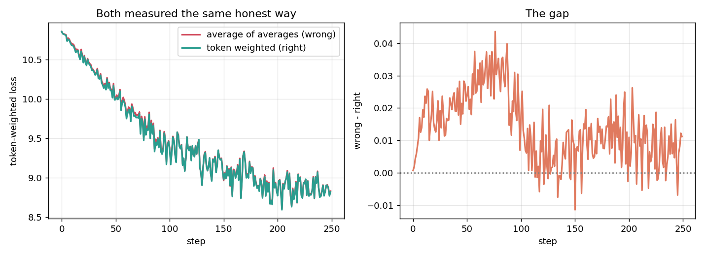
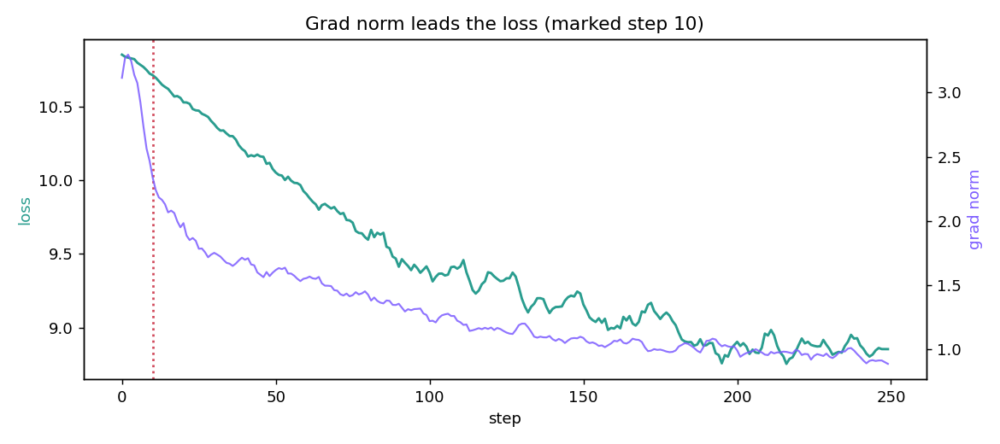

<h1 align="center">Making a training loop tell the truth about itself</h1>
<p align="center">A small model, a real loop, and six things it is made to confess.</p>
<p align="center">Tejaskumar Reddy J · ERA V5</p>

**Notebook:** [`training_lab.ipynb`](training_lab.ipynb) — runs top to bottom, CPU or GPU.
**Script:** [`training_lab.py`](training_lab.py) — the source of truth; the notebook is generated from it.

Model: 4-layer, `d_model=192`, GPT-2 tokenizer (`V=50,257`), 21,103,104 parameters,
wikitext-2. Every number below is printed by the code and mirrored into
`results.json`. Run on CPU (2 threads); see the MFU section for why that matters.

---

## 1. Every tensor in the step, and what each dimension means

| tensor | shape | what each dimension means |
|---|---|---|
| `ids` | `(8, 64)` | B=batch (independent sequences), T=time (position within a sequence) |
| `emb(ids)` | `(8, 64, 192)` | B, T, D. D = residual-stream width each token carries |
| `logits` | `(8, 64, 50257)` | B, T, V. One score per possible next token, at every position |
| `logits[:, :-1]` | `(8, 63, 50257)` | drop the last position — it would predict past the end |
| `ids[:, 1:]` | `(8, 63)` | drop the first token — nothing precedes it, so nothing predicts it |
| flat logits | `(504, 50257)` | `(B*(T-1), V)`. `cross_entropy` wants 2-D: one row per prediction |
| flat targets | `(504,)` | one gold token id per prediction |
| `loss` | `()` | scalar. Mean negative log-probability over contributing positions |
| `emb.weight` | `(50257, 192)` | V, D. One learned vector per vocabulary entry |
| `emb.weight.grad` | `(50257, 192)` | always the same shape as the weight — one gradient per parameter |
| `head.weight` | `(50257, 192)` | V, D. Projects the residual stream back to vocabulary scores |
| `blocks[0].att.in_proj_weight` | `(576, 192)` | 3D, D. Q, K and V projections stacked into one matrix |

`loss = 10.850420` over 504 predictions.

## 2. Verify one gradient by hand

Weight checked: `emb.weight[645, 7]` — the row for token `' no'`.

```
analytic gradient from backward() : 0.0031938477777822
numeric  (central difference)     : 0.0031938477107474   at h = 1e-4
```

**7.7 matching decimal digits** (relative error `2.10e-08`).

| h | numeric | rel err | matching decimals |
|---|---|---|---|
| 1e-3 | 0.0031938409934540 | 2.12e-06 | 5.7 |
| **1e-4** | **0.0031938477107474** | **2.10e-08** | **7.7** |
| 1e-5 | 0.0031938478528559 | 2.35e-08 | 7.6 |
| 1e-6 | 0.0031938478528559 | 2.35e-08 | 7.6 |
| 1e-7 | 0.0031938451883207 | 8.11e-07 | 6.1 |

Two choices make this work, and both are the difference between "several
decimals" and "looks broken":

**float64.** The identical check in float32 gives a relative error of **4.93e-01** —
*half a decimal digit*. The gradient is fine; the measurement is not. In fp32 the
loss carries ~7 significant digits, so subtracting two nearby losses leaves almost
nothing. This is the trap: run the check in the dtype you train in, and a correct
gradient looks wrong.

**Central difference.** `(L(w+h) − L(w−h)) / 2h` has error `O(h²)`; the one-sided
form is `O(h)` and throws away decimals for free.

The error is a V in `h`: too large and the truncation term dominates, too small and
catastrophic cancellation does. The minimum sits near `h ≈ ε^(1/3)`, about `6e-6`
for float64, which is exactly where the table bottoms out.

## 3. Gradient accumulation, broken on purpose

Micro-batches rarely hold equal token counts. When they do not, averaging the
per-micro-batch averages gives every micro-batch an equal vote regardless of size:

```
wrong :  L = (1/K) · Σ_k  mean_over_tokens_in_k(loss)
right :  L = Σ_k sum(loss_k)  /  Σ_k n_tokens_k
```

Micro-batch token counts used: **252, 20, 192, 28** — a 12.6× spread.

**On a single step, untrained, same data:**

| | loss |
|---|---|
| average of averages | 10.8977 |
| token weighted | 10.8700 |
| **difference** | **+0.0277** |

**After 250 steps**, both arms measured the same honest way (token-weighted):

| arm | final loss |
|---|---|
| average-of-averages | 8.8312 |
| token-weighted | 8.8200 |
| **gap** | **+0.0112** |



The wrong arm is persistently worse and the gap does not close. The 20-token
micro-batch is pulling the update as hard as the 252-token one, so ~12× more
gradient weight per token flows from the least informative batch in the step.

The gap is modest here because both arms see identical data and the reweighting is
bounded. It grows with the length spread — which is exactly why it is dangerous:
on a corpus with mixed document lengths it degrades training quietly, and neither
curve looks wrong on its own.

## 4. Grad norm moves before the loss does

Logged every step. Step-to-step loss is noisy enough that picking a single step
from raw values just finds noise, so both the aggregate and one concrete step are
reported.

**Aggregate evidence** — cross-correlation of Δ(grad norm) with Δ(loss) at
increasing lag:

| loss lags grad norm by | r |
|---|---|
| 0 steps | −0.119 |
| 1 | +0.071 |
| 3 | +0.099 |
| **5** | **+0.179** |

Correlation is *negative* at lag 0 and strongest at **lag 5**: the grad norm leads.

**One concrete step — step 10:**

| step | grad norm (smoothed) | loss (smoothed) |
|---|---|---|
| 8 | 2.5639 | 10.7505 |
| 9 | 2.4668 | 10.7260 |
| **10** | **2.3369** | **10.7151** ← grad norm moves |
| 11 | 2.2403 | 10.6978 |
| 12 | 2.1838 | 10.6753 |
| 13 | 2.1649 | 10.6510 |

At step 10 the grad norm moved **5.3%** while the loss moved **0.0109**; over the
next 5 steps the loss then moved **0.0929**, about **8× larger**.



This is what makes grad norm worth logging. It reflects a change in the loss
*surface* in the step where that change occurs; the loss *value* can only show it
after the optimiser has taken steps in response. A grad-norm spike is visible
before the loss curve bends — which is why it catches an instability while there
is still time to intervene.

## 5. MFU, reported honestly

```
parameters N        21,103,104
flops per token     127,208,448      (6N + 12·L·H·Q·T, the PaLM/nanoGPT convention)
tokens per step     512
step time           737.3 ms
achieved            0.0883 TFLOP/s
```

Peak measured by sweeping GEMM sizes rather than trusting one number:

| GEMM | TFLOP/s |
|---|---|
| 512² | 0.0741 |
| 1024² | 0.0929 |
| 2048² | 0.0976 |
| **3072²** | **0.1009** |

**MFU = 87.51% against measured CPU peak.**

**That number is not what it looks like, and I am not going to present it as a
win.** The denominator is a 2-thread CPU GEMM at 0.1 TFLOP/s, which is a very low
bar. It is not comparable to published MFU figures, which use accelerator vendor
peak. The same achieved throughput against real hardware:

| reference | MFU |
|---|---|
| A100 bf16 (312 TFLOP/s) | 0.0283% |
| T4 fp16 (65 TFLOP/s) | 0.1359% |
| L4 bf16 (121 TFLOP/s) | 0.0730% |

An earlier version of this measurement reported **113.67%** — above 100%, which is
the unmistakable signature of a bad denominator. It came from timing a single
2048² GEMM that happened to run slower than the model's own matmuls. Sweeping
sizes and taking the best fixed it.

### What is costing the distance to 40%

Measured, not guessed:

| | |
|---|---|
| forward only | 123.9 ms |
| forward + backward | 616.7 ms |
| optimiser step | 164.3 ms — **22% of the step** |
| vocab projection | **46% of counted model FLOPs** |
| batch | 512 tokens; GEMMs ≈ 512×192×192 |

Four things, in order of how much they cost:

1. **The GEMMs are far too small.** 512×192×192 does not fill a matrix unit. At
   `d_model=192` every matmul is launch- and memory-bound rather than compute-bound.
   This alone is most of the gap on any accelerator.
2. **The vocabulary projection is 46% of the FLOPs** for a `d_model` of 192.
   `V=50,257` against `D=192` means the head is 262× wider than the model. Nearly
   half the counted work goes into one badly-shaped matmul.
3. **The optimiser is 22% of wall time.** AdamW over 21M parameters is pure
   elementwise memory traffic and contributes zero counted FLOPs, so it is a direct
   subtraction from MFU. Fusing it would recover most of that.
4. **No fused attention, fp32 throughout, no compile.** `nn.MultiheadAttention` in
   eager fp32 materialises the score matrix; bf16 with a fused kernel and
   `torch.compile` would cut both traffic and launches.

The honest summary: at this size MFU is not a meaningful target. Getting near 40%
needs a bigger `d_model`, a much larger batch, bf16, fused attention and a fused
optimiser — i.e. a different model, not a better loop.

## 6. The number 0.1 in three formats

0.1 is not representable in binary: it is `0.0001100110011...` repeating forever.
Every format stores something slightly else.

| | layout | bits | stored value | rel. error |
|---|---|---|---|---|
| **fp32** | 1 · 8 · 23 | `0 01111011 10011001100110011001101` | 0.10000000149011612 | 1.49e-08 |
| **bf16** | 1 · 8 · 7 | `0 01111011 1001101` | 0.10009765625 | 9.77e-04 |
| **fp8 E4M3** | 1 · 4 · 3 | `0 0011 101` | 0.1015625 | 1.56e-02 |

Worked by hand for fp8 E4M3: `0.1 = 1.6 × 2⁻⁴`. Exponent `−4 + bias 7 = 3 = 0011`.
The mantissa has 3 bits, so 1.6 must land on a multiple of ⅛:

```
1.500 (100) -> 0.09375     error 0.00625
1.625 (101) -> 0.1015625   error 0.0015625   <- nearer, chosen
```

giving `0 0011 101` — which is what the hardware produced.

**Resolution near 0.1**, the number that actually decides whether an update survives:

| | ulp at 0.1 | updates below this vanish |
|---|---|---|
| fp32 | 7.451e-09 | 3.7e-09 |
| bf16 | 4.883e-04 | 2.4e-04 |
| fp8 E4M3 | 7.812e-03 | 3.9e-03 |

### Which would I train in

**bf16 for compute, fp32 for master weights and optimiser state.**

The reason is the **exponent field, not the mantissa**. bf16 keeps all 8 exponent
bits of fp32, so it covers the same dynamic range (~1e-38 to 3e38). Gradients that
would silently flush to zero in fp16 survive — which is why bf16 needs no loss
scaling and fp16 does. It pays with 7 mantissa bits (~2–3 decimal digits), and that
is affordable because a minibatch gradient is already a noisy estimate.

What is *not* affordable is **accumulating** in it. The table above is the argument:
a bf16 weight near 0.1 cannot absorb an update smaller than about 2.4e-4. A typical
late-training update is well below that, so it would round to nothing — the model
would stop learning while the loss curve looked perfectly stable. Master weights and
optimiser moments stay fp32.

**fp8 E4M3 for forward matmul inputs only, with per-tensor scaling.** Three mantissa
bits give a 1.6% relative error on 0.1, and four exponent bits make the range narrow
enough that tensors must be rescaled into it. Fine for GEMM operands whose output
accumulates in higher precision; not fine for anything summed over many terms, and
never for weights that are updated.

So: **fp8 where numbers are consumed immediately, bf16 where they flow, fp32 where
they accumulate.**

## Running it

```bash
pip install torch transformers datasets matplotlib
python training_lab.py     # prints everything, writes results.json + both figures
python to_notebook.py      # regenerates training_lab.ipynb from training_lab.py
```

On Colab, open `training_lab.ipynb` and Run All. Set **Runtime → GPU** if you want
the MFU number to mean anything — on CPU it is measured against a CPU GEMM peak and
is not comparable to published figures.

## Honest limits

- **MFU on CPU is close to meaningless** and is labelled as such above. The GPU run
  gives the number worth quoting.
- **The accumulation gap (+0.0112) is small** because both arms see identical data
  over 250 steps. The single-step difference (+0.0277) is the cleaner evidence; the
  effect scales with length spread, not with training time.
- **Item 4 picks one step out of 250.** The cross-correlation table is the honest
  aggregate claim; the single step is illustrative, and it is chosen from smoothed
  series because raw step-to-step loss here is dominated by minibatch noise.
- **The gradient check verifies one weight**, chosen because it participates in the
  batch. A full `gradcheck` over every parameter would be the stronger claim.
- **21M parameters is 88% embedding and head** (`2 × 50,257 × 192`), which inflates
  `N` in the MFU formula relative to a model with a sane vocab-to-width ratio.
