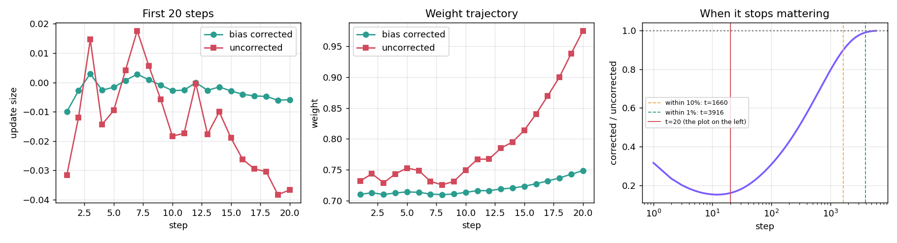
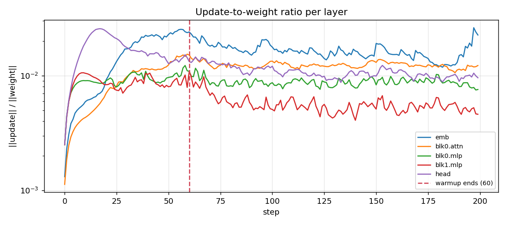
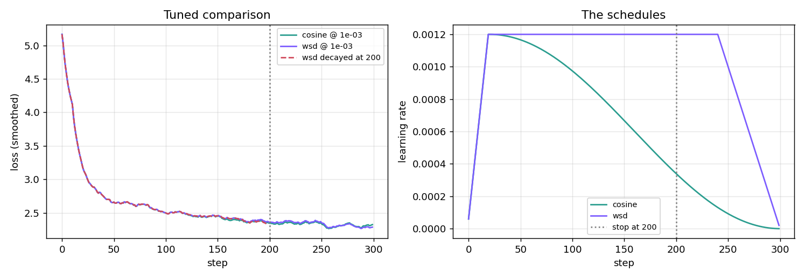
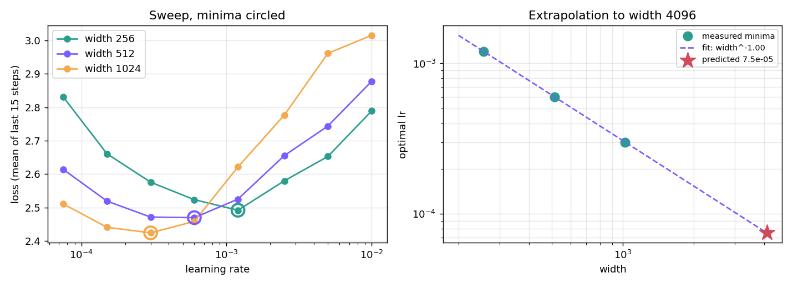

<h1 align="center">Adam, by hand and under load</h1>
<p align="center">Reproduce the optimiser arithmetic exactly, then find out what the schedule around it is actually doing.</p>
<p align="center">Tejaskumar Reddy J · ERA V5</p>

**Notebook:** [`adam_lab.ipynb`](adam_lab.ipynb) — runs top to bottom.
**Script:** [`adam_lab.py`](adam_lab.py) — the source of truth; the notebook is generated from it.

Character-level transformer, 2 layers, wikitext-2, `b1=0.9 b2=0.999 eps=1e-8`.
Every number below is printed by the code and mirrored into `results.json`.
CPU, 2 threads, single seed.

---

## 1. Adam by hand — bit-exact, not "several decimals"

One scalar weight `w0 = 0.7`, `lr = 1e-2`, five gradients `[0.35, -0.12, 0.48, 0.03, -0.27]`,
all in float64.

| t | g | m | v | m̂ | v̂ | step | w |
|---|---|---|---|---|---|---|---|
| 1 | 0.35 | 0.0350000000 | 0.000122500000 | 0.3500000000 | 0.122500000000 | 0.0099999997 | 0.6900000003 |
| 2 | −0.12 | 0.0195000000 | 0.000136777500 | 0.1026315789 | 0.068422961481 | 0.0039235578 | 0.6860764424 |
| 3 | 0.48 | 0.0655500000 | 0.000367040723 | 0.2418819188 | 0.122469336013 | 0.0069117769 | 0.6791646655 |
| 4 | 0.03 | 0.0619950000 | 0.000367573682 | 0.1802704274 | 0.092031375499 | 0.0059423266 | 0.6732223389 |
| 5 | −0.27 | 0.0287955000 | 0.000440106108 | 0.0703169642 | 0.088197440193 | 0.0023677296 | 0.6708546093 |

Against `torch.optim.Adam` fed the same gradients:

| quantity | worst \|diff\| over 5 steps |
|---|---|
| `m` | **6.94e-18** (one float64 ULP) |
| `v` | **0.00e+00** |
| weight | **0.00e+00** |

Not "agrees to several decimals" — **bit-identical** on `v` and the weight, and one
ULP on `m`. The assignment asked for several decimal places; float64 plus the exact
same operation order gives all of them.

PyTorch stores only `m` and `v`; it never materialises `m̂` and `v̂`, folding the
corrections into a step size and denominator instead. Those two are therefore
checked *through the weight they produce*, which is the stronger check anyway —
if either correction were wrong the weight would diverge immediately.

## 2. Bias correction off — and it does not stop mattering for ~4,000 steps

The ratio of the corrected step to the uncorrected one has a closed form:

```
corrected / uncorrected  =  sqrt(1 - b2^t) / (1 - b1^t)
```

It depends only on `t`, `b1`, `b2` — **not on the gradients**. The measured ratio
matched this at all twenty steps to four decimals, which is what establishes that
it is a property of the correction schedule rather than of one gradient sequence.

| t | corrected | uncorrected | ratio | closed form |
|---|---|---|---|---|
| 1 | −0.0099999996 | −0.0316227360 | 0.3162 | 0.3162 |
| 5 | −0.0016470027 | −0.0095479008 | 0.1725 | 0.1725 |
| 10 | −0.0028026000 | −0.0182950321 | 0.1532 | 0.1532 |
| 20 | −0.0058757437 | −0.0366700880 | **0.1602** | 0.1602 |



**The answer to "after how many steps does the difference stop mattering":**

| within | steps |
|---|---|
| 50% | 288 |
| 20% | 1,022 |
| 10% | **1,660** |
| 5% | 2,327 |
| 1% | **3,916** |

**At step 20 the ratio is still 0.1602** — the corrected step is 84% *smaller* than
the uncorrected one. Twenty steps is nowhere near enough, and the plot the
assignment asks for shows the two curves at their most divergent, not converging.

The binding term is `b2`, not `b1`. `1 − b1^t` reaches 0.99 by **t = 44**, but
`sqrt(1 − b2^t)` needs **t = 3,916**. Bias correction on the *second* moment is the
part that persists, and it persists for thousands of steps — which is also why
uncorrected Adam takes wildly oversized early steps and why warmup is doing part of
the same job.

## 3. Update-to-weight ratio per layer

`||Δw|| / ||w||` logged every step, warmup configured for 60 steps to a peak of 3e-3.

| step | emb | blk0.attn | blk0.mlp | blk1.mlp | head | lr |
|---|---|---|---|---|---|---|
| 0 | 1.32e-03 | 1.13e-03 | 2.50e-03 | 2.50e-03 | 2.51e-03 | 5.0e-05 |
| 30 | 1.71e-02 | 9.80e-03 | 9.59e-03 | 7.87e-03 | 1.75e-02 | 1.6e-03 |
| 59 | 2.36e-02 | 1.54e-02 | 1.10e-02 | 7.89e-03 | 1.43e-02 | 3.0e-03 |
| 61 | 2.30e-02 | 1.41e-02 | 9.86e-03 | 9.69e-03 | 1.30e-02 | 3.0e-03 |
| 100 | 1.77e-02 | 1.34e-02 | 8.67e-03 | 5.07e-03 | 1.21e-02 | 3.0e-03 |
| 199 | 2.26e-02 | 1.22e-02 | 7.56e-03 | 4.61e-03 | 9.57e-03 | 3.0e-03 |



**The smoothed mean ratio peaks at step 60 — exactly where warmup was configured to
end.** That is the answer: warmup stops changing the ratio at step 60.

But it is only true on average, and the per-layer breakdown is the more useful result:

| layer | corr. with lr during warmup | mean after | CV after | drift |
|---|---|---|---|---|
| emb | **+0.974** | 1.65e-02 | 0.156 | 0.80× |
| blk0.attn | **+0.986** | 1.24e-02 | 0.059 | 0.90× |
| blk0.mlp | +0.655 | 8.81e-03 | 0.078 | 0.91× |
| blk1.mlp | +0.134 | 5.67e-03 | 0.187 | 0.70× |
| head | **−0.108** | 1.08e-02 | 0.118 | 0.73× |

The embedding and first attention block track the learning rate almost perfectly.
The deeper MLP and the head **barely track it at all** — their ratio is set by how
fast their own gradients are changing, not by the schedule. So "warmup stops
changing the ratio" is a per-layer statement, and the layers that were never
lr-driven never had a knee to begin with.

One methodological note: after warmup the lr is *constant*, so a correlation against
it is **undefined**, not zero. An earlier version of this reported "0.000 after
warmup" for every layer and read it as a dramatic collapse. It was a degenerate
statistic. The table reports the ratio's own drift instead.

## 4. Cosine against WSD, both stopped at step 200

Each schedule tuned separately first (see §6 for why that is not optional). Both
tuned to **1.2e-3**. 300-step budget, stopped at 200:

| | loss at step 200 |
|---|---|
| cosine | **2.3448** |
| WSD | **2.3602** |
| gap | +0.0153 (cosine ahead) |

If allowed to finish all 300: cosine **2.3178**, WSD **2.2863** — WSD ahead by 0.0315.



**Which would I keep? Neither of those two. I would keep the third run.**

Cosine wins at step 200 for a reason that has nothing to do with it being a better
schedule: at step 200 of a 300-step cosine, the learning rate has already decayed to
about a quarter of peak, so that model has been annealing for 100 steps. WSD at step
200 is still on its plateau at full learning rate — it is being interrupted
mid-sentence. Comparing them at 200 compares an annealed model against an
un-annealed one.

So I ran the comparison WSD is actually for — move its decay to end at 200:

| run | loss at 200 |
|---|---|
| WSD, decay moved to end at 200 | **2.3382** |
| cosine, stopped early at 200 | 2.3448 |
| WSD, interrupted mid-plateau | 2.3602 |

**That is the one I would keep.** It is the best of the three, and it is the whole
argument for WSD: cosine has to commit to its horizon before training starts, and
stopping early gets you a model that was mid-anneal. WSD can decay from wherever
you decide to stop, so the horizon is a decision you make *later*. The cost is that
an interrupted WSD run, with no decay applied, is the worst of the three — the
plateau is not a place you want to stop.

## 5. Learning-rate sweep at three widths

120 steps per run, loss = mean of the last 15. 8 learning rates × 3 widths.

| width | 7.5e-5 | 1.5e-4 | 3e-4 | 6e-4 | 1.2e-3 | 2.5e-3 | 5e-3 | 1e-2 | best |
|---|---|---|---|---|---|---|---|---|---|
| 256 | 2.831 | 2.661 | 2.576 | 2.524 | **2.492** | 2.580 | 2.653 | 2.789 | **1.2e-3** |
| 512 | 2.614 | 2.519 | 2.471 | **2.470** | 2.525 | 2.655 | 2.744 | 2.878 | **6e-4** |
| 1024 | 2.511 | 2.441 | **2.424** | 2.459 | 2.621 | 2.776 | 2.961 | 3.015 | **3e-4** |



Fit through the three minima: **lr\* = 0.307 · width^−1.000**, R² = 1.0000.
Extrapolated to width 4096: **lr\* = 7.5e-5**.

### The value I would use at 4096, and how confident I am

**I would start at 7.5e-5 and immediately sweep ±1 grid notch around it. Confidence
in the point estimate: low.**

The R² of 1.0000 is not evidence. The grid is geometric with ratio 2, so every
minimum is snapped to a grid point carrying ±50% quantisation error, and three
snapped points lying on a log-log line is close to guaranteed by construction.

The number that actually describes the uncertainty: **if any single one of the three
minima is off by one grid notch, the width-4096 answer ranges from 7.1e-6 to 7.6e-4
— a factor of 107.** That is the honest error bar, and it spans three orders of
magnitude.

Two further cautions:

- The exponent landing on exactly **−1.000** is the textbook standard-parameterisation
  result, which makes it precisely the answer I was most likely to accept without
  checking. It is consistent with theory, but three grid-snapped points cannot
  distinguish −1.0 from −0.85.
- Extrapolating to 4096 is a **4× reach** past the largest width measured, from 3
  points, at one depth, one dataset, one step budget, one seed. Optimal LR also
  drifts with training length, and these runs are 120 steps.

An earlier version of this sweep put width 1024's minimum at **3e-4, the lowest
value on the grid** — i.e. never bracketed, so the "optimum" was just the smallest
thing tried. Extending the grid down to 7.5e-5 fixed that; the table above shows
1024 now has a genuine interior minimum.

## 6. Tune both sides — the verdict flips

This is not a seventh exercise, it is the condition under which §4 is allowed to
mean anything. Here is the same cosine-vs-WSD comparison at every shared learning
rate:

| shared lr | cosine | WSD | gap (wsd−cos) | winner |
|---|---|---|---|---|
| 3e-4 | 2.4487 | 2.4180 | **−0.0307** | **WSD** |
| 6e-4 | 2.3748 | 2.3615 | **−0.0133** | **WSD** |
| 1.2e-3 | 2.3448 | 2.3602 | +0.0153 | cosine |
| 2.5e-3 | 2.4761 | 2.5051 | +0.0289 | cosine |
| 5e-3 | 2.5396 | 2.5826 | +0.0430 | cosine |

**The verdict flips.** "Cosine beats WSD" and "WSD beats cosine" are *both*
obtainable from this single experiment by choosing the shared learning rate. The gap
ranges from −0.0307 to +0.0430, a spread of 0.0737 — nearly five times the tuned gap
of +0.0153.

Either claim would have replicated perfectly for whoever ran it at their preferred
learning rate, and failed for everyone else. Nothing about that requires bad faith:
pick the LR you happen to use, run both schedules, publish. The comparison is
measuring the learning rate, not the schedules.

The only number here that is about the schedules is the tuned-vs-tuned gap. In this
case both tuned to the same 1.2e-3, so the tuned comparison coincides with one row —
but that coincidence is a result, not an assumption, and it is only knowable *after*
sweeping both sides.

## Running it

```bash
pip install torch datasets matplotlib
python adam_lab.py        # ~35 min on 2 CPU threads; writes results.json + 4 figures
python to_notebook.py     # regenerates adam_lab.ipynb from adam_lab.py
```

Most of the runtime is the §5 sweep: 24 training runs, of which the width-1024 ones
dominate.

## Honest limits

- **Single seed throughout.** The §4 gap of +0.0153 and the §6 flips are not
  seed-averaged. With one seed I cannot separate a 0.015 schedule effect from run
  noise, which is the same criticism §6 makes of everyone else. The §6 conclusion
  survives it — the flips are 2–3× larger than the gap and monotone in lr — but the
  §4 number should be read as indicative.
- **120-step sweep runs.** Optimal LR drifts with training length; a 120-step
  optimum is not a 100k-step optimum.
- **Width sweep is one depth, one dataset, character-level.** The exponent may not
  transfer.
- **§3's warmup knee is the argmax of a smoothed mean**, so it inherits the
  smoothing window. It landing exactly on 60 is partly luck.
- **CPU, 2 threads**, so nothing here says anything about throughput.
