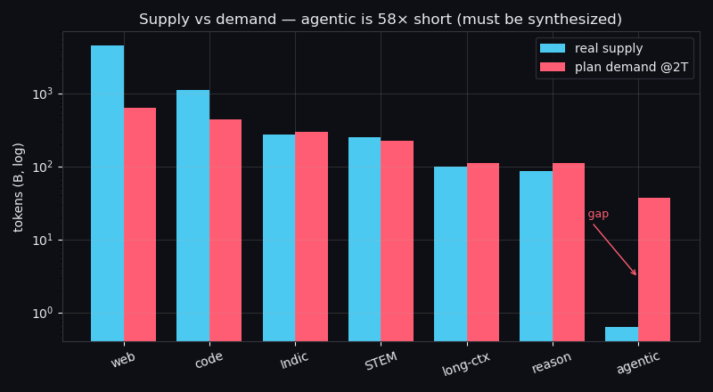
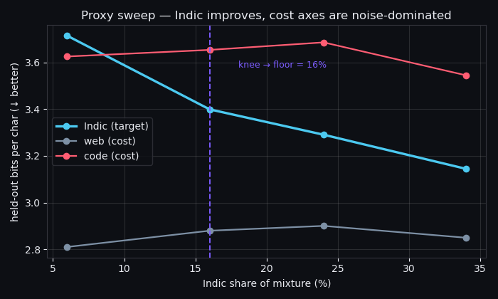
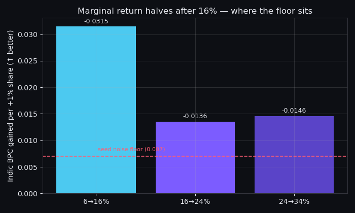

<h1 align="center">V5 Mixture &amp; Curriculum Plan</h1>

<p align="center">
  <b>Tejaskumar Reddy J</b> · ERA V5 · Session 5 — Data Mixtures and Curriculum
</p>

<p align="center">
  
  
  
  
  
</p>

> A 40B model strong at coding and agentic work, with controllable reasoning depth and native
> Indic fluency. Budget **2T tokens**. Every share below is sized against the Session 5 dataset
> inventory, and **the Indic floor comes from a proxy sweep I actually ran** — not a round number.

### At a glance

| | |
|---|---|
| **Mixture** | web 34 · code 24 · Indic 16 · STEM 12 · reasoning 6 · long-ctx 6 · agentic 2 |
| **Indic tiers** | verified 25 · crawl 30 · translated 20 · synthetic 25 |
| **Protected floor** | Indic ≥12% · agentic ≥2% · reasoning ≥4% |
| **Anneal reserve** | 150B (7.5%), quarantined from day 0 |
| **Proxy** | 5 runs · 3.75M params · real streamed data · knee at **16%** |
| **Headline finding** | agentic is **254×** short of the data it needs — it must be built, not collected |

**Contents** — [Claims](#0-the-three-claims-this-plan-rests-on) ·
[Budget](#1-budget-2t-tokens) · [Mixture](#2-the-mixture) · [Indic tiers](#3-indic-split-across-tiers) ·
[Agentic](#4-agentic-a-build-order-not-a-share) · [Repetition](#5-repetition-and-synthesis-stated-plainly) ·
[Protected floor](#6-the-protected-floor--and-why-nominal-floors-lie) · [Anneal](#7-anneal-reserve--quarantined-from-day-0) ·
[Bands](#8-difficulty-and-reasoning-length-bands) · [**Proxy results**](#9-proxy-experiment--run-not-just-specified) ·
[Curriculum](#10-curriculum) · [What would change my mind](#11-what-would-make-me-change-this-plan)

---

## 0. The three claims this plan rests on

1. **The agentic lane cannot be collected — it must be built.** Inventory supply is 0.63B
   tokens. `WEIGHTED_MIN` in the composer says a lane needs ≥8% of the budget to move its
   benchmarks. 8% of 2T is 160B. That is a **254× gap** against 5 named benchmarks
   (SWE-bench, τ-bench, BFCL, GAIA, BrowseComp). So I do **not** try to win agentic from
   pretraining. Pretraining buys *format*; SFT/RL buys *capability*. §4.
2. **A protected floor stated in nominal share is worth ~⅕ of what it looks like**, because
   protected lanes bypass OPUS and therefore earn no selection multiplier. A 14% nominal
   floor is 2.6% of effective learning signal. Fix: protect by *changing the judge*, not by
   *removing the judge*. §6.
3. **For scarce lanes, rephrasing beats repetition.** Verified Indic is the binding tier;
   repeating it 2–4× verbatim burns the most precious data we have. Kimi K2 and Nemotron-CC
   both report rephrased/synthetic passes outperforming verbatim epochs. §5.

---

## 1. Budget: 2T tokens

40B params. Chinchilla-optimal is ~800B; frontier practice trains well past it. I take **2T
(~50 tok/param)**, and the reason is the inventory, not taste: total real supply across all
lanes is **6.31T**. At 2T no lane except agentic exceeds the 4× repetition line. At 5T,
reasoning (85B) and long-context (100B) both blow past 4× and the plan would be built on
data that does not exist. **2T is the largest budget this inventory actually supports.**

Split: **1.85T main pretraining + 0.15T anneal** (7.5% reserve).



*Every lane's demand at 2T against the inventory's real supply (log scale). Web and code have
slack; STEM/reasoning/long-ctx are near their coverage limit; agentic's supply bar is invisible
next to its demand — the 58× gap that §4 is about.*

## 2. The mixture

Main pretraining (1.85T):

| Lane | Share | Demand | Supply | Verdict |
|---|--:|--:|--:|---|
| General web | 34% | 629B | 4.5T | covered |
| Code | 24% | 444B | 1.1T | covered |
| Indic | 16% | 296B | 276B | 1.07× — mild repetition |
| STEM / math | 12% | 222B | 250B | covered |
| Reasoning | 6% | 111B | 85B | 1.31× repetition |
| Long-context | 6% | 111B | 100B | 1.11× repetition |
| Agentic | 2% | 37B | 0.63B | **58.7× — synthesize 36.4B** |

Anneal (0.15T): web 8 · code 20 · Indic 28 · STEM 10 · reasoning 18 · long-ctx 8 · agentic 8.

Combined over 2T: web 32.1 · code 23.7 · **Indic 16.9** · STEM 11.9 · reasoning 6.9 ·
long-ctx 6.2 · agentic 2.5.

**Why each number:**

- **Web 34%** — not a dumping ground. It is the only lane that funds MMLU-style breadth, and
  dropping it below ~30% in the naive-vs-pretrain comparison is what costs world knowledge.
  It is also the only lane with slack to absorb renormalization.
- **Code 24%** — targets LiveCodeBench/Aider, and code transfers to non-code reasoning
  (structure, decomposition, long dependency chains). Held at 24% not higher because
  excessive code share measurably degrades other benchmarks.
- **STEM 12%** — AIME/GPQA. Sits just under its 12.5% coverage ceiling, deliberately: this is
  the largest share STEM can take without repeating.
- **Reasoning 6% / long-ctx 6%** — both are supply-capped (4.25% / 5% coverage). 6% already
  means repetition; going to the 8% benchmark threshold would mean 1.9×/1.6× and I would
  rather buy reasoning depth in the anneal and in RL, where it is cheaper per point.
- **Indic 16%** — set by the proxy run in §9, not by ambition.
- **Agentic 2%** — the floor, and honestly labelled: 98.3% of it is synthetic. §4.

## 3. Indic split across tiers

Indic total = **338B** over the run. Verified-native supply is the constraint: Session 3 gives
Sangraha verified/total at 3.7/16.3 (Telugu) and 1.2/12.5 (Odia) — roughly 10–23%. I take 20%
of the 276B headline ⇒ **~55B genuinely verified native tokens exist.**

| Tier | Share | Tokens | Sourcing reality |
|---|--:|--:|---|
| A · verified native | 25% | 85B | 55B unique → **1.55 epochs**. Never more. |
| B · unverified crawl (cleaned) | 30% | 101B | ~221B available, covered |
| C · translated | 20% | 68B | covered; capped because translationese degrades native fluency |
| D · synthetic | 25% | 84B | **rephrased from Tier A seeds**, not free generation |

Tier D is deliberately *derived from Tier A*, so it inherits provenance and stays anchored to
real native text. This is the Kimi K2 / Nemotron-CC rephrasing result applied to the one place
it matters most: it converts our 55B of verified Indic into ~139B of usable A+D signal without
spending 4 verbatim epochs on it. Nemotron-CC also warns the curve turns over — hence D is
capped at 25%, not pushed higher.

Benchmarks: MILU, IndicGenBench. Languages: Hindi, Telugu, Marathi, Bengali, Tamil, Kannada,
Odia, Assamese — with per-language floors so the 8 do not collapse into Hindi, which is the
failure mode a single headline Indic number hides.

## 4. Agentic: a build order, not a share

Supply 0.63B against a 160B benchmark-moving threshold. Two honest options: pretend, or build.

**Pretraining (37B, 2%) buys format only** — tool-call syntax, JSON argument structure,
multi-step trajectory shape, observation/action alternation. Format is cheap to learn and does
not need 8%.

**Capability is bought after the base model exists**, which is where the session's own
lifecycle puts it: anneal (12B of the best trajectories) → SFT → RL with verifiable rewards.
These stages are tiny in tokens and high in value per token.

**The generation program** (Kimi K2's pipeline is the template): simulate tool environments,
generate task specs, run agents to produce trajectories, then filter with an LLM judge against
rubrics and keep only successful, verified runs. Masking rule is non-negotiable: **loss on the
model's planning, tool calls and final answer; no loss on tool observations.** Training on
observations teaches the model to hallucinate tool results instead of calling tools.

36.4B synthetic agentic tokens at ~4k tokens/trajectory ≈ **9M verified trajectories**. That is
the real cost of the 2% line, and it is stated here rather than hidden.

## 5. Repetition and synthesis, stated plainly

| Lane | Unique | Epochs at plan | Method |
|---|--:|--:|---|
| Indic Tier A | 55B | 1.55× | verbatim, then rephrase into D |
| Reasoning | 85B | 1.31× | verbatim |
| Long-context | 100B | 1.11× | verbatim |
| Agentic | 0.63B | — | 98.3% synthesized |
| Code / STEM / web | — | <1× | covered |

Nothing in this plan exceeds ~1.6 verbatim epochs except agentic, which is not repeated at all
because there is nothing to repeat.

## 6. The protected floor — and why nominal floors lie

Floor: **Indic ≥12%, agentic ≥2%, reasoning ≥4%** of every batch, always-on, outside selector
control. V4 protected Indic at 8%; V5 extends protection to agentic and reasoning.

But V4-style protection has a measurement bug that I have not seen stated. OPUS retains ~40%
of candidates and delivers a **~6× effective-token multiplier**. Protected lanes bypass the
selector, so they earn **1×**. Effective share of a protected lane is

```
eff = p / (p + M(1 - p))        M = 6
p = 0.14  ->  eff = 0.14 / (0.14 + 5.16) = 2.6%
```

**A 14% nominal floor delivers 2.6% of effective learning signal — less than V4's nominal 8%
looked like.** Solving `eff = 0.14` for p gives p = 53%, which is absurd. So you cannot buy an
effective floor with a nominal floor.

**Fix: protect by changing the judge, not by removing it.** Run a second, Indic-tuned selector
over the protected lane — same OPUS machinery, different proxy direction. If it achieves even
M=4 on the protected pool:

```
eff = (0.14 x 4) / (0.14 x 4 + 6 x 0.86) = 9.8%
```

Protection then means *which proxy is allowed to judge you*, not *whether you are judged* —
and the scarce lane keeps a selection multiplier instead of forfeiting it. This is the single
change I would most want tested at 1B scale.

## 7. Anneal reserve — quarantined from day 0

**150B (7.5%)**, tagged at ingestion and never visible to the main-run sampler:

| Reserve | Tokens | Selection rule |
|---|--:|---|
| Verified Indic, top quality | 42B | Tier A, top classifier decile, human-origin |
| Agentic trajectories | 12B | verified-success, multi-tool, ≥6 steps |
| Long reasoning traces | 27B | L2/L3 bands, verified final answers |
| Curated code | 30B | test-verified patches, SWE-shaped diffs |
| STEM / long-ctx / web | 39B | competition math, full-book contexts |

The anneal only works if the reserve survives the main run — if the selector eats the best
Indic and agentic data at 40% of the way in, there is nothing left to concentrate. OLMo 2 moved
grade-school math from 24% to 67% with a reserve tiny beside the full run; that upside is only
available to a plan that reserved on day 0.

## 8. Difficulty and reasoning-length bands

**Difficulty ladder** (applies within every stage):

| Band | Level | Real example |
|---|---|---|
| D1 | foundational | `print("hello")` semantics; "The capital of Karnataka is Bengaluru." |
| D2 | intermediate | GSM8K: "A shop sells 3 pens for ₹45. What do 7 pens cost?"; LeetCode-easy two-sum |
| D3 | advanced | MATH/AIME: "Find the number of ordered pairs (a,b) of integers with a²+b² ≤ 100 and a+b odd."; SWE-bench-lite patch |
| D4 | frontier | GPQA-diamond graduate physics; multi-file repo bug needing repo-wide reasoning; HLE items |

**Reasoning-length bands** (the effort dial is trained, not conjured at inference):

| Band | Tokens | Example task | Trace shape |
|---|--:|---|---|
| L0 direct | ≤64 | "15% of 240?" | "36." — no trace |
| L1 short | 65–512 | GSM8K word problem | 3–5 explicit steps, no backtracking |
| L2 long | 513–4096 | AIME geometry | sets up, tries an approach, **verifies intermediate result**, corrects |
| L3 ultra | 4097–32768 | Olympiad proof / repo-wide debug | explores ≥2 alternatives, rejects one with reason, self-corrects, verifies |

Mix inside the reasoning lane: **L0 10% · L1 40% · L2 35% · L3 15%**, spanning math, code and
general problem solving. A reasoning lane that is all-long produces a model that cannot answer
"2+2" cheaply; all-short produces one that cannot sustain a proof. RL later teaches the model
to *map the requested effort setting onto these bands*.

## 9. Proxy experiment — run, not just specified

**Hypothesis.** Indic held-out bits-per-character improves with Indic share but with
diminishing returns; the knee locates the floor. English/code degradation in that region is
sublinear, so the knee is affordable.

**Design.** 4 arms + 1 seed repeat, identical everything except Indic share ∈ {6, 16, 24, 34}%,
code fixed at 25%, web absorbing the remainder. 3.75M params, 500 steps, 3.07M tokens/arm, tokenized with
**my own Session 2 wiki-faithful 10k BPE**, on **Session 4-cleaned** Sangraha Telugu+Hindi,
FineWeb-Edu, and CodeParrot. Metric: **held-out bits-per-character**, because tokens-per-char
differ per language (measured: web 2.74, Indic 2.49, code 1.89) and nats/token is therefore not
comparable across lanes. A proxy's job is to *rank* recipes, not reproduce final scores.

**Results.** 3.75M params, 500 steps, 3.07M tokens/arm. Held-out BPC (lower is better):

| Indic share | web | **Indic** | code | ΔIndic per point |
|--:|--:|--:|--:|--:|
| 6% | 2.8103 | 3.7143 | 3.6254 | — |
| 16% | 2.8798 | **3.3991** | 3.6536 | **−0.0315** |
| 24% | 2.9005 | 3.2906 | 3.6858 | −0.0136 |
| 34% | 2.8497 | 3.1445 | 3.5448 | −0.0143 |
| 34% (seed 2) | 2.8760 | 3.1514 | 3.5899 | — |





*Top: Indic BPC falls with share while the cost axes stay flat and noisy. Bottom: Indic gain
per added point — the 6→16% bar towers over the red seed-noise line (0.007); the 16→24 and
24→34 bars are barely 2× noise. The steep region ends at 16%.*

**Noise floor, measured not assumed.** The seed repeat gives a spread of **Indic 0.007, web
0.026, code 0.045 BPC**. So the Indic axis is ~4–6× more stable than the English/code axes,
and every Indic delta above is 16–46× its own noise. They are real.

**What the proxy establishes.** Indic BPC improves monotonically, and the marginal gain per
point drops **2.3× after 16%** (−0.0315 → −0.0136) and then flattens at ~−0.014. The steep
region ends at 16%: below that we are leaving the cheapest Indic gains unrealized.

**What the proxy fails to establish, stated plainly.** The *cost* side is not measured
reliably at this scale. Between 24% and 34% both web (−0.038) and code (−0.119) BPC *improved*
while Indic share rose — which cannot be causal, since those lanes lost budget. Both moves
exceed the seed noise, so this is not just variance; it means a 3.75M-param model trained on
3M tokens is too undertrained to price the trade-off. **This proxy can locate the Indic floor
but cannot locate the Indic ceiling.** Anyone reading this plan should discount the cost
column entirely and hold me to the 1B run for it.

**So where does 16% come from?** Two independent constraints meet there:
- **From below (proxy):** the marginal-gain knee at 16%.
- **From above (inventory):** 276B supply ⇒ 13.8% coverage; 16% of 1.85T = 296B = 1.07 epochs.
  Pushing to 24% would mean 1.6 epochs, and to 34% would mean 2.3 epochs on a lane whose
  verified tier is only ~55B.

The proxy says *do not go below 16%*; the supply says *do not go far above it*. 16% is the
intersection, not a preference.

**Refutation conditions, stated in advance.** If the 1B run shows Indic still gaining steeply
at 24% *with a measurable cost curve*, the floor rises and web pays for it. If web/code
degrade sharply before 16% once the cost side is measurable, the floor falls.

**Scale-up before this is trusted.** Same 4 arms at **1B** (20B tokens) and the two survivors
at **3B** (60B tokens), scored on MILU + IndicGenBench (Indic), HumanEval + LiveCodeBench
(code), GSM8K + AIME (reasoning), MMLU (breadth). **Go/no-go metric: MILU at fixed compute,
with MMLU allowed to drop no more than 1.5 points.** Plus the §6 experiment: protected-bypass
vs protected-with-Indic-selector at 1B, measured as effective-token multiplier on the Indic
pool — that is the number that decides whether the floor mechanism is right.

## 10. Curriculum

| Stage | Tokens | Mixture move | Difficulty | Seq len |
|---|--:|---|---|--:|
| S0 seed | 0–100B | web-heavy, basic code | D1 | 4k |
| S1 general | 100B–900B | broad; Indic floor active from token 0 | D1→D2 | 8k |
| S2 capability | 900B–1.5T | code/STEM/reasoning up, web down | D2→D3 | 16k |
| S3 long-context | 1.5T–1.85T | long-ctx to 6%, extend rope | D3 | 32k→128k |
| S4 anneal | 1.85T–2T | reserve only, LR cooldown | D3→D4 | 32k |

**Every transition is blended across a 20B-token warmup band.** V4 changed the Hindi share
abruptly against frozen embeddings and the gradient norm jumped ~150×. Mixture changes are
architectural events, not config edits: never a hard step, always monitored on gradient-norm.

## 11. What would make me change this plan

- Indic knee lands above 24% in the 1B proxy → raise the floor, fund it from web.
- Rephrased Tier D underperforms verbatim Tier A repetition → cut D to 10%, accept 2.5 epochs.
- Agentic synthesis yields <50% judge pass rate → the 9M-trajectory number is fiction; cut
  pretraining agentic to 1% and move the whole lane into SFT/RL.
- Protected-with-selector shows no multiplier gain over bypass → revert to V4-style bypass and
  raise the nominal floor to 20%.

## Reproduce

```bash
pip install datasets tokenizers torch numpy regex matplotlib
python proxy/build_corpus.py     # streams + cleans pools, tokenizes with the S2 BPE
python proxy/train_proxy.py      # 4-arm sweep -> proxy/proxy_results.json
python proxy/make_plots.py       # figures/*.png from the real results
```

## Sources

Session 3/4/5 material and the composer inventory (`SUPPLY_T`, floors, `WEIGHTED_MIN=8`,
presets, tier split). Kimi K2 (agentic data synthesis at scale, rephrasing over repetition),
Nemotron-CC (synthetic rewriting, and where the curve turns over), OLMo 2 (anneal upside),
DeepSeekMath (seed → classifier → mine loop for growing a scarce lane), FineWeb-Edu
(classifier filtering), Chinchilla (token budget).
