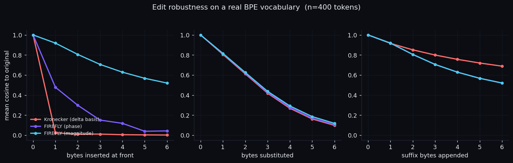
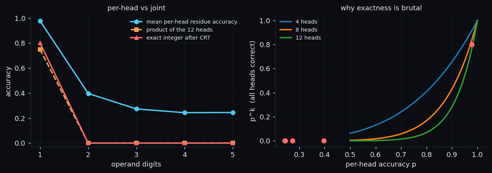
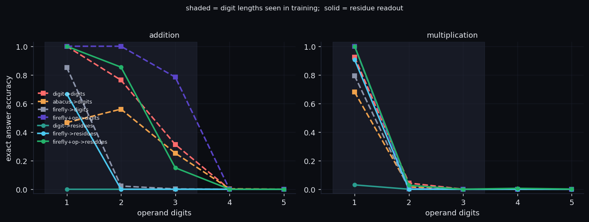
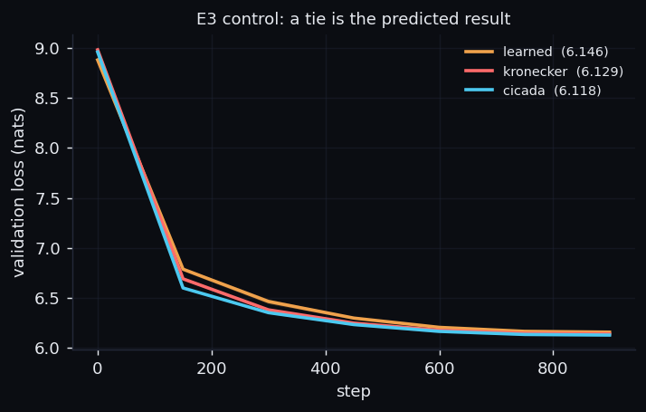
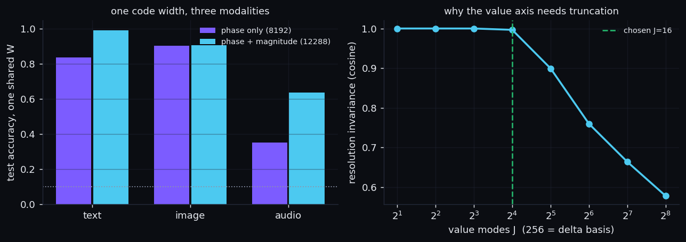
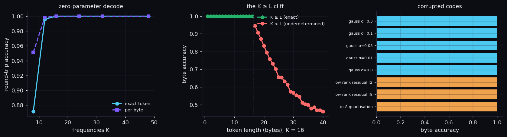

<h1 align="center">✨ FIREFLY</h1>
<p align="center"><b>F</b>ourier <b>I</b>nterference <b>R</b>epresentations for <b>E</b>mbedding <b>F</b>ields of any <b>L</b>ength or dimensionalit<b>Y</b></p>
<p align="center">Tejaskumar Reddy J · ERA V5 · Kronecker Embeddings V2</p>

<p align="center">
  
  
  
  
</p>

```bash
pip install -r requirements.txt
python run_all.py
```

Runs the invariant suite and all six experiments on CPU, writing `results/*.json`,
`figures/*.png` and `results/run.log`. Every number below is produced there;
`tools/write_readme_results.py` writes the Results section, so nothing is typed by hand.

---

## Why a firefly

Two reasons, and both are the method rather than decoration.

**A firefly's species is its flash frequency.** Entomologists identify them by flash
rate and inter-pulse interval, not by appearance. Identity carried as a temporal
frequency signature is exactly what this operator does to a token.

**Fireflies synchronise by phase coupling.** Thousands of independent local
oscillators sum into global coherence. That is the encoder — each character
contributes a wave and the word is their interference pattern — and it is also the
numeric block, where phases add elementwise and the sum *is* the arithmetic.

(The coprime moduli in the numeric block are a Chinese-Remainder-Theorem choice, not
an entomological one. The analogy is to phase, not to primes.)

## The problem I picked

**Problem 4 — a real Fourier alternative to Kronecker.** *"Why can't I represent each
character like a Fourier wave, and just add them to make a word?"*

Problems 1, 3 and 5 fall out of the same operator and are reported as corollaries.
Problem 2 is demonstrated but not claimed as a headline.

## The idea

The Kronecker codec is one equation:

```
κ(b) = (1/√L) Σ  c_{b_p} ⊗ p_p                    256 × 32 = 8192
             p=1..L
```

A one-hot byte crossed with a **one-hot position**. Everything that paper lists in
its own limitations follows from that second one-hot: positions capped at 32,
truncation past the cap, and "insertion/deletion shifts all following bytes."

FIREFLY keeps the byte axis and replaces the position basis with a Fourier basis on
a **fixed** grid:

```
Φ[c, k] = (1/√L) Σ        exp(−i·ω_k·p)           256 × 16 × 2 = 8192
                 p: b_p=c
```

Same width — a drop-in swap needing no change to the downstream projection.

> **Everything is a byte field over an index domain. Embed the field's spectrum on a
> fixed grid, and the code's width depends on the grid alone — never on the data's
> length, resolution or dimensionality.**

That last clause is FNO's mode truncation, moved from PDE solutions to embeddings.

### Two axes, and only one is always Fourier

The index axis is Fourier, always. The basis on the **value** axis is a property of
the data, and getting it wrong is what broke my first multimodal attempt:

| values are… | basis | why |
|---|---|---|
| symbols (text bytes) | delta | `'a'` is not a near-miss of `'b'`; a metric would be noise |
| magnitudes (pixels, μ-law samples) | truncated cosine | 137 really *is* next to 138 |

These are the same construction: a delta basis is the *untruncated* transform of the
value alphabet, and truncating it to J modes is what **creates** a metric on values.

I found this the hard way. With a one-hot value axis, resampling a picture moves a
pixel from 137 to 138 — an unrelated channel — and resolution invariance scored
**0.65**. With J=16 cosine modes it scores **0.995**. The delta case is kept as a
negative control in the test suite.

## Problem 1 — mathematics stored, not learned

```
add block   z_m(n) = exp(2πi·n / P_m)                 z(a) ⊙ z(b) = z(a+b)
mul block   u_m(n) = exp(2πi·ind_g(n) / (P_m−1))      u(a) ⊙ u(b) = u(a·b)
            u_m(n) = 0  when  n ≡ 0 (mod P_m)         — and 0 propagates correctly
P = (2,3,5,7,11,13,17,19,23,29,31,37)   48 real dims   exact below 7,420,738,134,810
```

Elementwise complex multiplication of two embeddings *is* the arithmetic. Nothing is
trained, nothing approximated; CRT reads the integer back. `9+9` decodes to 18 and
`9×9` to 81, by construction. The `mul` block works because `Z_P*` is cyclic of order
`P−1`, so the discrete logarithm turns multiplication into addition of indices.

**There are no carries.** Residues against coprime moduli are independent, so
`999999+1` costs what `1+1` costs.

## Problem 5 — invertible, at zero cost

```
Φ = X·F/√L   ⇒   X = √L · Φ · pinv(F)          exact whenever K ≥ L
L = ( Σ_c Φ[c,0] )²                            length, from the code itself
```

`F[p,k] = z_k^p` with distinct nodes is Vandermonde, so it has full rank when K ≥ L.
Length comes from the DC bin, so no side channel is needed. The full round trip —
code → length → bytes — needs **no vocabulary, no learned decoder, no parameters**.

**The NCA is gone.** I built one (a local shared update rule seeded with the spectral
code, motivated by FourierDiff-NCA) on the theory that a learned decoder would beat
the closed form on noisy codes. It lost in every regime, including the
underdetermined one built for it. The reasoning was wrong: with a uniform grid,
`pinv` *is* a matched filter, which is the optimal estimator under white noise, so
there was no error left to correct. 630k parameters and a torch dependency deleted;
the measurement is preserved in `results/e5_nca.json`.

## Prior art

| Work | What it does | How FIREFLY differs |
|---|---|---|
| [Kronecker Embeddings](https://arxiv.org/html/2605.29459v1) | byte ⊗ one-hot position, frozen, 8192-d | same width, Fourier position basis instead of delta |
| [FoNE](https://arxiv.org/abs/2502.09741) | Fourier **number** embeddings, 100% on add/sub/mul | FoNE is a numbers-only bolt-on with base-10 periods, so carries remain and the model *learns* to add. Here numbers are a special case of one operator and `⊙` is exact with no carries. |
| [Abacus](https://arxiv.org/pdf/2405.17399) | shared position ids per digit significance | our arithmetic baseline |
| [FNO](https://arxiv.org/html/2404.07200v1) | learned kernels on truncated modes → resolution invariance | same truncation argument, applied to an embedding |
| [FourierDiff-NCA](https://arxiv.org/abs/2401.06291) | Fourier injection gives an NCA global reach | motivated the decoder that then lost |

## The caveat I publish first

**For tokens of at most 32 bytes, `Φ = κ·F` for a fixed full-rank `F`.** A learned
projection can absorb `F` entirely, so the two codecs carry *identical* information
about short tokens and must tie on short-token text. `fourier_from_kronecker_matrix()`
returns that matrix and a test asserts the identity.

Where the gains actually are, after the devil's-advocate pass below cut the list down:

| Claimed gain | Survives? |
|---|---|
| tokens longer than 32 bytes | **Yes** — Kronecker destroys the information |
| 2-D and continuous index domains | **Yes** — the delta basis has no such notion |
| resolution invariance → one shared width | **Yes** — delta grid scales with resolution |
| the numeric block | **Yes** — new dimensions, nonlinear in token identity |
| zero-parameter invertibility | **Yes** — though Kronecker is trivially invertible below 32 bytes |
| magnitude / shift invariance | **Retracted** — see below |
| short-token English LM loss | **No** — it ties, as predicted |

### The claim I had to retract

I claimed `|Φ|` gives shift invariance that no linear projection could manufacture
from `κ`. **That is false**, and E1 now measures why.

`|Φ[c,:]|` is the magnitude of a sum of unit phasors, one per occurrence of byte `c`.
If `c` occurs **once**, that magnitude is 1 regardless of position — so for any string
with no repeated byte, `|Φ|` is *exactly the byte histogram*, which a linear map reads
off `κ` by summing its position axis. Measured: `listen`/`silent` and `abc`/`cba` both
score 1.0000 under `|Φ|`, identical to the histogram.

Fitting `κ → |Φ|` by least squares reaches R²≈0.93, and the reconstruction **keeps**
the shift invariance (0.862 at one inserted byte, against 0.917 for the true
magnitude). So FIREFLY's edit-robustness advantage is an advantage over an
*untrained* Kronecker code — and Kronecker is never deployed untrained.

What survives: `|Φ|` carries information beyond a histogram only where bytes repeat
(`aabb` vs `abab` → 0.905 under `|Φ|`, 1.000 under a histogram). That is a real but
narrow difference, and much smaller than the E1 headline suggests.

## Results

<!--RESULTS-->

### E1 — geometry, no training

400 real BPE tokens from `wikitext-2`.

| probe | Kronecker | FIREFLY phase | FIREFLY magnitude |
|---|---|---|---|
| cosine after 1 byte inserted | 0.023 | 0.478 | **0.919** |
| cosine after 3 bytes inserted | 0.011 | 0.151 | **0.706** |
| median rank of the prefixed form | 1431 | 42 | **1** |
| cosine after 3 substitutions | 0.420 | 0.427 | 0.438 |
| cosine after 3 suffix bytes | **0.800** | 0.706 | 0.706 |

Suffix growth is a genuine **loss**: appending bytes renormalises the whole spectrum while a delta basis leaves prefix spikes untouched.

**The devil's-advocate probe that cost me the headline.**

| test | result |
|---|---|
| linear fit κ → Φ (control, should be ≈1) | R² 0.9860 |
| linear fit κ → \|Φ\| | R² 0.9282 |
| that reconstruction, after 1 byte(s) inserted | 0.862 (true \|Φ\| 0.917) |
| that reconstruction, after 2 byte(s) inserted | 0.825 (true \|Φ\| 0.803) |
| that reconstruction, after 3 byte(s) inserted | 0.768 (true \|Φ\| 0.702) |

The reconstruction **keeps** the invariance, so the projection *can* manufacture it. Reason:

- `abc` vs `cba` — \|Φ\| 1.000, byte histogram 1.000  ← identical
- `listen` vs `silent` — \|Φ\| 1.000, byte histogram 1.000  ← identical
- `abab` vs `baba` — \|Φ\| 1.000, byte histogram 1.000

`|Φ[c,:]|` is the magnitude of a sum of unit phasors, one per occurrence of byte `c`. One occurrence ⇒ magnitude 1 regardless of position, so with no repeated byte **`|Φ|` *is* the byte histogram**, which a linear map reads off `κ`. Claim retracted.



### E2 — arithmetic: input representation × output space

Trained on 1–3 digit operands (digit count uniform), tested to 5. Free-running decode for digit outputs; CRT for residues.

**addition**

| input → output | 1d | 2d | 3d | 4d | 5d |
|---|---|---|---|---|---|
| `digit->digits` | 100.0% | 76.3% | 31.3% | 0.0% | 0.0% |
| `abacus->digits` | 46.6% | 56.0% | 25.2% | 0.3% | 0.0% |
| `firefly->digits` | 85.2% | 2.2% | 0.2% | 0.0% | 0.0% |
| `firefly+op->digits` | 100.0% | 100.0% | 78.4% | 0.0% | 0.0% |
| `digit->residues` | 0.0% | 0.0% | 0.0% | 0.0% | 0.0% |
| `firefly->residues` | 66.6% | 0.0% | 0.0% | 0.0% | 0.0% |
| `firefly+op->residues` | 100.0% | 85.4% | 15.0% | 0.0% | 0.0% |

**multiplication**

| input → output | 1d | 2d | 3d | 4d | 5d |
|---|---|---|---|---|---|
| `digit->digits` | 92.4% | 4.3% | 0.0% | 0.0% | 0.0% |
| `abacus->digits` | 67.9% | 1.5% | 0.0% | 0.0% | 0.0% |
| `firefly->digits` | 79.3% | 0.1% | 0.0% | 0.0% | 0.0% |
| `firefly+op->digits` | 100.0% | 0.4% | 0.0% | 0.0% | 0.0% |
| `digit->residues` | 3.0% | 0.0% | 0.0% | 0.0% | 0.0% |
| `firefly->residues` | 90.5% | 0.0% | 0.0% | 0.0% | 0.0% |
| `firefly+op->residues` | 100.0% | 2.7% | 0.0% | 0.6% | 0.1% |

Columns past 3 digits were never seen in training.

**Two hypotheses, both refuted.** I first blamed the digit readout and swapped it for residue heads + CRT (no parameters). That did not rescue it either — nothing generalises past 3 digits in any cell of the grid.

E2b settles which explanation is right, because the two have opposite implications. CRT needs all 12 residues simultaneously correct, so per-head accuracy `p` gives exact accuracy `p¹²`. Is the failure that compounding, or can the heads simply not read residues?

| operand digits | mean per-head | worst head | p¹² | exact integer |
|---|---|---|---|---|
| 1 | 0.977 | 0.824 | 0.7488 | 0.8010 |
| 2 | 0.397 | 0.229 | 0.0000 | 0.0000 |
| 3 | 0.273 | 0.027 | 0.0000 | 0.0000 |
| 4 | 0.243 | 0.036 | 0.0000 | 0.0000 |
| 5 | 0.245 | 0.018 | 0.0000 | 0.0000 |

**The heads cannot read residues.** Per-head accuracy collapses from 0.977 at one digit to 0.397 at two — this is not compounding, it is the model failing to learn modular addition at all, the same difficulty the grokking literature documents. So neither the input representation nor the output format is the binding constraint: a 3-layer model trained for 2500 steps cannot exploit the structure even when it is handed to it exactly.



**What did work, inside the trained range.** The one arm that does not ask the model to do arithmetic — `firefly+op`, handed `compose(a,b)` from the frozen operator — beats every baseline where it is trained: 100.0% vs 76.3% at 2 digits, 78.4% vs 31.3% at 3. It still cannot extrapolate, because the output must emit more digits than it ever produced in training. The algebra is exact (E0, zero parameters); using it through a learned readout is where it is lost.



### E3 — text LM control (a tie was predicted)

| arm | val loss | input-side trainable params |
|---|---|---|
| `learned` | 6.146 ± 0.003 | 1,310,720 |
| `kronecker` | 6.129 ± 0.004 | 1,310,720 |
| `firefly` | 6.118 ± 0.002 | 1,310,720 |

FIREFLY − Kronecker = **-0.0113** nats, seed noise 0.0047, minimum detectable effect ≈ **0.0092** nats.

So the comparison *could* have seen the 0.083-nat effect the source paper reports for Kronecker over BPE; it measures something 7× smaller. Scale caveat: 3L / d160 / 900 steps on CPU, reaching 6.118 nats against 9.011 for random guessing.



### E4 — one operator, one width, three modalities

| modality | code width | budget split | phase only | phase + magnitude |
|---|---|---|---|---|
| text | 8192 | `256 value (delta) x 16 index x 2` | 83.7% | 99.2% |
| image | 8192 | `16 value x 16^2 spatial x 2` | 90.3% | 90.6% |
| audio | 8192 | `16 value x 256 time x 2` | 35.2% | 63.7% |

One **shared** projection versus three private ones — private minus shared: text -0.002, image -0.003, audio +0.033. Sharing costs little, which is the claim.

Resolution invariance on **real images** (MNIST, bilinear resample) rather than one synthetic field:

| resample | mean cosine | worst case |
|---|---|---|
| 32->64 | 0.9788 | 0.9631 |
| 32->128 | 0.9788 | 0.9654 |
| 64->128 | 0.9959 | 0.9915 |

Value-mode sweep — why the value axis must be truncated (J was *chosen* on this sweep, so the real-image row above is the independent check):

| J | 2 | 4 | 8 | 16 | 32 | 64 | 128 | 256 |
|---|---|---|---|---|---|---|---|---|
| resolution cosine | 1.000 | 1.000 | 1.000 | 0.997 | 0.899 | 0.760 | 0.664 | 0.578 |

At J=256 the value basis *is* a delta basis and invariance collapses.



### E5 — decoding with no output vocabulary and no parameters

| K | exact round trip | byte accuracy | params |
|---|---|---|---|
| 8 | 87.2% | 95.1% | **0** |
| 12 | 99.6% | 99.8% | **0** |
| 16 | 100.0% | 100.0% | **0** |
| 24 | 100.0% | 100.0% | **0** |
| 32 | 100.0% | 100.0% | **0** |
| 48 | 100.0% | 100.0% | **0** |

Replacing a 536,870,912-parameter softmax head. Length is recovered from the code's own DC bin, so no side channel is needed.

The K ≥ L condition is real and sharp — measured on real text spans, because BPE tokens never get long enough to reach it:

| token bytes | 8 | 16 | 17 | 20 | 24 | 32 | 40 |
|---|---|---|---|---|---|---|---|
| exact | 100.0% | 100.0% | 38.3% | 2.5% | 0.0% | 0.0% | 0.0% |

Corrupted codes — a real head *predicts* the code rather than computing it:

| corruption | exact | byte |
|---|---|---|
| Gaussian σ=0.01 | 100.0% | 100.0% |
| Gaussian σ=0.03 | 100.0% | 100.0% |
| Gaussian σ=0.1 | 100.0% | 100.0% |
| Gaussian σ=0.3 | 96.5% | 99.7% |
| int8 quantisation | 100.0% | 100.0% |
| low rank residual r8 | 100.0% | 100.0% |
| low rank residual r2 | 100.0% | 100.0% |

**The learned decoder that lost.** A 628,801-parameter NCA, trained with noise and damage augmentation and a randomised lattice:

| regime | closed form | NCA |
|---|---|---|
| well posed, K=24 | 1.000 exact | 0.742 exact |
| compressed, K=10 | 0.991 byte | 0.977 byte |

> The learned decoder lost in every regime, including the underdetermined one built for it. With a uniform grid pinv IS a matched filter, which is the optimal estimator under additive white noise, so there was no error to correct. Removed.



### Negative results, collected

- **The shift-invariance claim is retracted.** `|Φ|` is the byte histogram whenever no byte repeats, and a linear map recovers it from `κ` (R²≈0.93) while keeping the invariance.
- **The NCA decoder lost** in every regime and was deleted. Two of four pre-registered predictions were refuted; one refutation was a reasoning error of mine (pinv on an orthogonal grid *is* the optimal estimator).
- **E2's first design refuted the length-generalisation claim** — with digit outputs, every arm scored 0.000 past 3 digits.
- **FIREFLY loses on suffix growth** (E1).
- **E3 is a near-tie**, as predicted from `Φ = κ·F`.
- **The first multimodal design silently failed**: a one-hot value axis treats pixel 137 and 138 as unrelated symbols, scoring 0.65. The fix came from that failing test; the delta-basis control is kept as a negative case.

<!--/RESULTS-->

## Layout

```
firefly/
  encoder.py    Φ for 1-D and 2-D fields, value-axis bases, Kronecker baseline
  numeric.py    coprime phase blocks, exact ⊙ arithmetic, CRT decode, residues
  decoder.py    closed-form inverse + length inference. No parameters, no torch.
  model.py      shared tiny transformer, plus the residue readout
  data.py       wikitext · MNIST · free-spoken-digit · language-id
  plots.py      figure style
experiments/    e1 geometry · e2 arithmetic · e2b residue diagnostic
                e3 LM control · e4 multimodal · e5 decoding
tests/          28 invariant assertions
web/            the Netlify page
run_all.py      one command, everything
```

## When this will not work

Every row is measured, not guessed. `✗` means it fails silently — the dangerous kind.

### Encoder

| Case | What happens | |
|---|---|---|
| Image patch smaller than 2× the spatial modes | `ValueError: 16x16 modes exceed Nyquist…` | ✓ loud |
| Non-band-limited images (sharp edges, noise, texture) | resolution invariance degrades; it is a band-limited property, and the guarantee is only as good as the mode budget | ✗ |
| Wrong value basis for the data | delta basis on pixels → resolution cosine **0.65** instead of 0.995; cosine basis on text destroys symbol identity | ✗ |
| Suffix-heavy morphology | **loses to Kronecker** (0.706 vs 0.800 at 3 suffix bytes) — appending renormalises the whole spectrum | ✗ |
| Empty input | all-zero code, inferred length 0 | ✓ benign |

### Decoder (zero-parameter round trip)

| Case | What happens | |
|---|---|---|
| **Token longer than K bytes** | the hard limit. K=16: L=16 → **100%**, L=17 → **38%**, L=20 → **3%**, L=24 → **0%** | ✗ |
| Grid without ω=0 | length inference breaks — it reads the DC bin | ✗ |
| Corruption past ~σ=0.3 | 96.5% at σ=0.3 and falling; int8 quantisation and low-rank residuals are fine (100%) | ✗ |
| Weight tying with the output head | impossible, D=8192 ≠ d_model — same limitation the Kronecker paper has | ✓ known |

### Numeric block

| Case | What happens | |
|---|---|---|
| Result ≥ 7,420,738,134,810 | **wraps silently**: `(M−1) + 5 → 4`, no error raised | ✗ |
| Negative results | returns the positive residue: `4 − 9 → 7420738134805`, correct mod M but not what a caller expects | ✗ |
| Non-integers | `3.7` is silently truncated to `3`; floats are not representable at all | ✗ |
| Numbers still inside text | the block assumes an integer has already been parsed out. Raw digit strings in a corpus do not trigger it — a pipeline must find them first | ✗ |
| Asking a model to *learn* to use it | E2b: per-head residue accuracy collapses 0.977 → 0.397 → 0.273 from 1 to 3 digits. The structure is exact; a small model cannot exploit it | ✗ |

### Claims that do not hold

| Claim | Status |
|---|---|
| Shift invariance as a Fourier-only property | **retracted** — a linear map on `κ` reaches R²=0.93 and keeps the invariance |
| `\|Φ\|` distinguishes byte order | **false** when no byte repeats — `abc` vs `cba` scores **1.000**, identical to a byte histogram |
| Better LM loss than Kronecker | **no** — ties, and the algebra (`Φ = κ·F`) says it must |
| Length generalisation on arithmetic | **no** — nothing generalises past the trained digit count, in any input × output combination |

## Honest limitations

- **CPU only.** 4 cores, no GPU. E3 is a control at a scale where only large effects
  would show; its minimum detectable effect is reported alongside the result.
- **The magnitude/shift-invariance claim is retracted** (above).
- **E2 refuted the length-generalisation claim as first designed** — see Results.
- **Numbers need a parser.** The numeric block assumes an integer has already been
  extracted; real text carries digit strings, so a pipeline must find them first.
  Beyond the modulus it wraps silently rather than erroring.
- **The multimodal result is three linear probes with separate heads**, not a
  multimodal model. Audio is weak in absolute terms — a standard MFCC pipeline would
  beat it comfortably.
- **J=16 was chosen on the same sweep that reports it.** The real-image resolution
  check is the independent one.
- **No large-scale LM comparison.** The drop-in claim is structural (identical width),
  not demonstrated at scale.

## References

Kronecker Embeddings ([arXiv:2605.29459](https://arxiv.org/html/2605.29459v1)) ·
LightningLM ([site](https://lightninglm.theschoolofai.in/)) ·
FoNE ([arXiv:2502.09741](https://arxiv.org/abs/2502.09741)) ·
Abacus ([arXiv:2405.17399](https://arxiv.org/pdf/2405.17399)) ·
FourierDiff-NCA ([arXiv:2401.06291](https://arxiv.org/abs/2401.06291)) ·
NCA: From Cells to Pixels ([arXiv:2506.22899](https://arxiv.org/abs/2506.22899)) ·
FNO spectral analysis ([arXiv:2404.07200](https://arxiv.org/html/2404.07200v1))

Data: wikitext-2-raw-v1 (CC BY-SA 3.0) · MNIST (CC BY-SA 3.0) ·
Free Spoken Digit Dataset · papluca/language-identification
