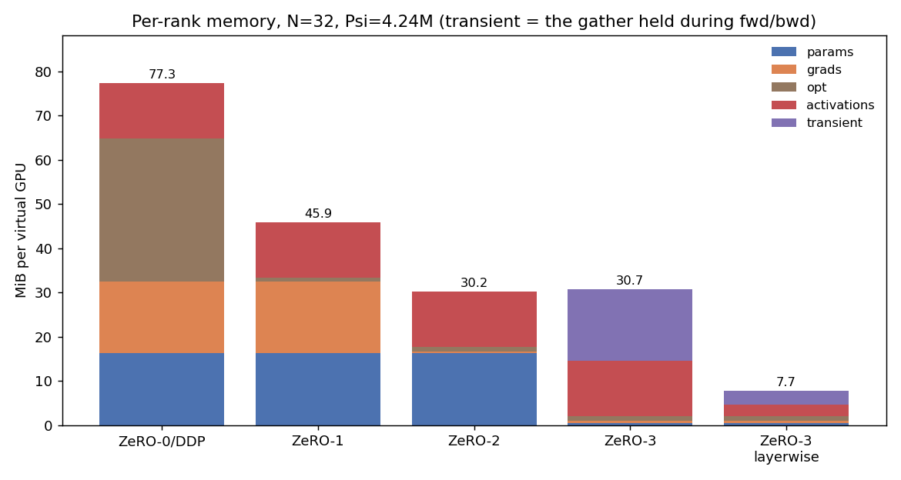
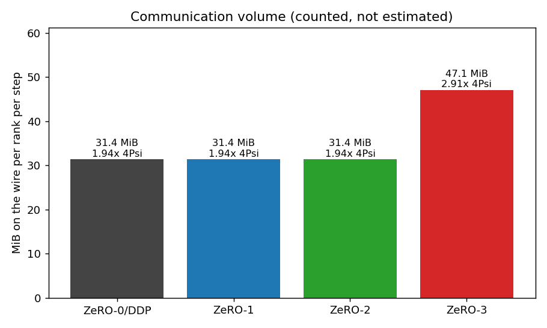
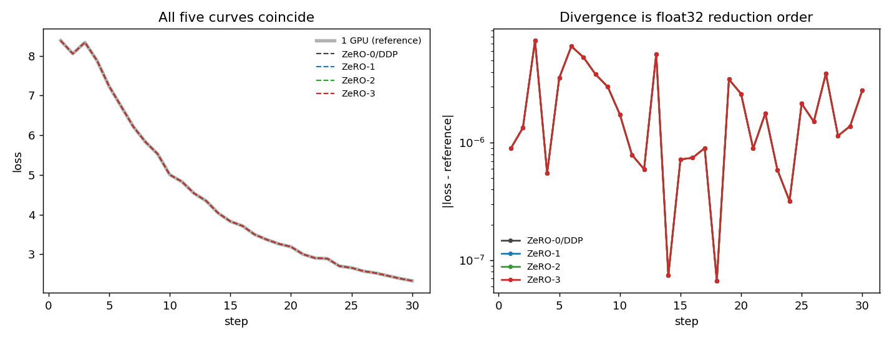
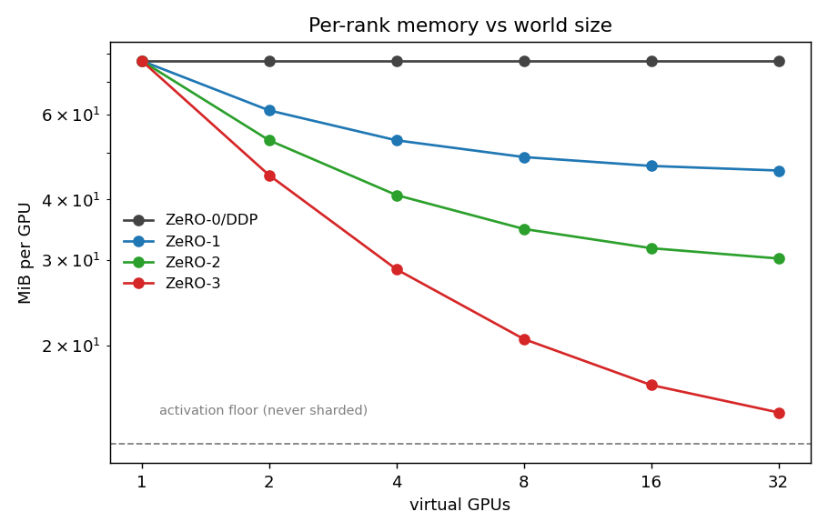

<h1 align="center">ZeRO on 32 Virtual GPUs</h1>
<p align="center">Thirty-two ranks, one flat parameter buffer, and the four stages measured rather than quoted.</p>
<p align="center">Tejaskumar Reddy J · ERA V5</p>

**Notebook:** [`zero_sim.ipynb`](zero_sim.ipynb) — runs top to bottom on CPU or Colab, no downloads, ~25 minutes.

---

## What this actually measures

This machine has **4 cores**. Running 32 ranks on it cannot be faster than running
one, and nothing here pretends otherwise. That constraint is worth stating up
front because it decides what the exercise can honestly claim.

ZeRO changes two things: **bytes resident on each device** and **bytes moved
between them**. Neither needs real parallelism to measure.

| | how it is obtained | trustworthy? |
|---|---|---|
| per-rank memory | real shards built at real offsets, real tensor sizes summed | yes, and cross-checked against process RSS in a clean subprocess |
| activation memory | autograd's `saved_tensors_hooks`, summing unique storages | yes — this is the definition, not an estimate |
| communication | counted inside the collectives as they fire | yes, and checked against the ring closed form |
| correctness | every stage must land on the single-device gradient | yes |
| **wall-clock** | measured, reported, and **not** a result | **no** — 32 ranks timeshared on 4 cores |

A rank here is a `VGPU` object: a byte ledger with a peak tracker. A ledger
rather than an allocator reading, because all 32 ranks live in one process and
RSS would report the simulator's footprint instead of a device's.

The simulator does take one shortcut, and it is the informative one. For
ZeRO-0/1/2 every rank holds a **bit-identical** copy of the parameters — that is
precisely the invariant DDP maintains — so the code stores one copy and charges
all 32. It is also a hard limit of this machine: 32 real replicas of the full
model state would be **2.02 GiB**, which is the entire reason ZeRO exists.
ZeRO-3 gets no such shortcut; its 32 shards are 32 separate tensors.

## The model

A 6-layer, `d_model=192` decoder, `Psi = 4,244,352` parameters, flattened into
one buffer and split 32 ways at `S = 132,636` elements per shard. fp32
throughout, so the full model state is `4 + 4 + 8 = 16` bytes per parameter —
which is, by coincidence, the same 16 bytes/param the ZeRO paper's
mixed-precision accounting gives (`2 + 2 + K` with `K = 12`).

Training data is 32 fixed 8-token motifs, randomly rotated and tiled. That
choice is load-bearing: on unlearnable noise every stage would sit flat at
`ln(V) = 8.32` forever and "all five loss curves coincide" would pass even with
the sharding completely broken. Here the loss goes **8.3834 → 2.3307** in 30
steps, so the curves agreeing means something.

---

## Results

| stage | params | grads | opt | steady / rank | peak / rank | vs DDP | comm / rank / step | vs DDP |
|---|---|---|---|---|---|---|---|---|
| ZeRO-0 (DDP) | full | full | full | **77.29 MiB** | 77.29 MiB | 1.00× | 31.37 MiB | 1.00× |
| ZeRO-1 | full | full | /N | **45.92 MiB** | 45.92 MiB | 1.68× | 31.37 MiB | 1.00× |
| ZeRO-2 | full | /N | /N | **30.24 MiB** | 30.24 MiB | 2.56× | 31.37 MiB | 1.00× |
| ZeRO-3 (gather-all) | /N | /N | /N | **14.55 MiB** | 30.74 MiB | 2.51× | 47.05 MiB | 1.50× |
| ZeRO-3 (layer-wise) | /N | /N | /N | **2.02 MiB** | 7.73 MiB | 10.00× | 47.05 MiB | 1.50× |

All five, plus a single-device reference, reach the **same final loss to six
decimal places** (2.330716).



---

## 1. Why everything starts with a flat buffer

Every ZeRO implementation flattens the parameters into one contiguous buffer
before sharding. That is not a micro-optimisation — it is what makes sharding
tractable. A shard becomes `theta[r*S:(r+1)*S]`, a plain slice, and the
collectives operate on one tensor instead of a few hundred.

The price is that shard boundaries land in the middle of parameter tensors. A
shard is a bag of bytes, not a list of layers. Rank 7 might own the last 40% of
`block2.fc1` and the first 15% of `block2.fc2` and have no way to name either.

That is fine for the optimizer, and the reason is the single most important fact
in ZeRO-1: **Adam is elementwise.** A slice of `(w, g, m, v)` is a complete,
self-contained optimizer problem. Rank 7 can step its bytes knowing nothing
about the other 31 and get exactly the answer a single device would. So ZeRO-1
is not an approximation of DDP — it is DDP, with the redundant copies deleted.

It becomes awkward in exactly one place: ZeRO-3, where the forward pass needs
whole tensors back. §5 is about that.

## 2. Who holds what

With `P = 4*Psi` bytes of fp32 parameters:

| stage | params | grads | optimizer | per rank |
|---|---|---|---|---|
| ZeRO-0 | `P` | `P` | `2P` | `16*Psi` |
| ZeRO-1 | `P` | `P` | `2P/N` | `8*Psi + 8*Psi/N` |
| ZeRO-2 | `P` | `P/N` | `2P/N` | `4*Psi + 12*Psi/N` |
| ZeRO-3 | `P/N` | `P/N` | `2P/N` | `16*Psi/N` |

The optimizer is the biggest single line item — `m` and `v` together are twice
the parameters — which is why ZeRO-1 alone already removes 48% of the model
state at N=32, before touching anything the backward pass depends on.

The measured ledger matches this closed form for all four stages, asserted in
the notebook. That assertion is not decoration; see §7.

## 3. Communication: why stages 1 and 2 are free

Ring collective costs, per rank, for a payload of `B` bytes:

```
all_reduce      2(N-1)/N * B
reduce_scatter   (N-1)/N * B
all_gather       (N-1)/N * B
```

`all_reduce = reduce_scatter + all_gather` — in cost **and** in effect. The
notebook verifies the second half of that claim numerically: scattering, reducing
per-shard, and gathering back reproduces the all-reduced tensor with
`max|diff| = 0.000e+00`.

That identity is the whole trick. DDP pays one all-reduce, `2(N-1)/N`. ZeRO-1 and
ZeRO-2 pay a reduce-scatter to get each rank its own gradient slice, then an
all-gather to put the updated parameters back — `2(N-1)/N` again. **Same bytes,
one third to two thirds less memory.** There is no trade being made.

ZeRO-3 is the one that costs something. Parameters no longer live anywhere whole,
so they must be gathered in the forward pass, gathered *again* in the backward
pass (they were freed in between — that is the point), and the gradients
reduce-scattered: `3(N-1)/N`, or **1.5× DDP**.

Measured, not assumed: 31.37 / 31.37 / 31.37 / 47.05 MiB per rank per step,
which the notebook asserts equals the closed form to within a byte.



## 4. Does it still compute the same thing?

It has to, and the check is the point of the exercise. But *what* you compare
matters more than it looks.

Comparing final **weights** against the single-device run gives `max|dw| = 1.14e-04`,
which is 0.5% of their own scale and looks like a bug. Comparing **gradients**
gives `2.24e-08` absolute, `4.17e-07` relative — clean float32.

Both numbers are correct. The gap between them is Adam, and it is the same
scale-free update from the previous session:

```
w <- w - lr * mhat / (sqrt(vhat) + eps)
```

For a parameter whose gradient is genuinely near zero, `mhat` and `sqrt(vhat)`
are both noise and their ratio is O(1) noise. The update is then governed by `lr`
rather than by the gradient, so a last-bit difference in a tiny gradient can move
the weight by a bounded-but-large amount — up to `2*lr` in the limit.

This model is full of near-dead parameters: only `32 * 8 = 256` of the 4096 token
ids ever appear, so most of the embedding and output-head rows see almost no
signal. And that is where the drift is. The 3 parameters that moved more than
`1e-4` have a median `|grad|` of `4.96e-09`, against `1.75e-04` across the model
— four to five orders of magnitude down.

Worth being precise about the endpoints, because the naive version of this
argument is wrong. A parameter with *exactly* zero gradient does not drift at
all: `m` and `v` stay at zero, so the update is `0 / (0 + eps) = 0` and both runs
leave it untouched. The 3,840 completely unused embedding rows are in that
category and contribute nothing. The drift comes from the band in between —
gradients small enough that reduction order decides their low bits, large enough
to escape `eps`.

Nor does the drift reach the ceiling: the largest is `0.04 * lr`, well under
`2*lr`. So `2*lr` is a bound, not a prediction. What the argument explains is the
*direction* — that vanishing gradients produce the largest weight differences,
and not the other way round.

So the honest correctness test for a sharding change is the gradient comparison,
not the post-Adam weight comparison. The loss curves agree to `7.39e-06`
throughout and the final losses are identical to six decimals.

There is a sharper version of the check hiding in the right-hand panel below:
only one line is visible because **the four stages are bit-identical to each
other** (`max|dw| = 0.00e+00` between any pair). They accumulate the same 32
micro-batches in the same order, so nothing can differ. The entire 1.14e-04 gap
is against the single-device reference, which reduces one batch of 64 instead of
32 batches of 2. Sharding introduces no numerical difference whatsoever; only
changing the *batching* does.



## 5. The ZeRO-3 trap

The naive ZeRO-3 gathers the whole parameter buffer, runs forward and backward,
then drops it. Every parameter byte is sharded. It looks like the maximal saving.

Measured peak per rank: **30.74 MiB**. ZeRO-2's peak: **30.24 MiB**.

Sharding the parameters made peak memory *slightly worse*. Steady-state
occupancy fell from 30.24 to 14.55 MiB, but for the entire duration of the
forward and backward pass the rank is holding `16*Psi/N + 4*Psi` — its shard
**plus a full copy** — and peak is what makes a job fit on a device, not average.

Real ZeRO-3 and FSDP never materialise the whole model. They gather one layer,
use it, free it, then gather the next, so the transient is one layer rather than
one model. Implementing that under autograd has a catch: a gathered tensor freed
after the forward pass is still needed for backward.

The way out is recomputation. If the gather happens **inside** a checkpointed
function, it is not saved — it is re-run during backward, used, and freed again.
Gradients still reach the shards because `torch.cat` is differentiable, which
means **the backward pass through the gather is itself the reduce-scatter**.
That is the actual FSDP design, and it is about fifteen lines:

```python
def gather_range(shards, lo, hi, S):
    """Rebuild theta[lo:hi] from only the shards that overlap it."""
    r0, r1 = lo // S, (hi - 1) // S
    return torch.cat([shards[r][max(lo - r * S, 0):min(hi - r * S, S)]
                      for r in range(r0, r1 + 1)])

h = torch.utils.checkpoint.checkpoint(fn, h, *shards, use_reentrant=False)
```

Result: transient drops from 16.19 MiB to **3.05 MiB** (5.3×, one block instead
of one model), and the gradients it produces match an ordinary unsharded backward
with `max|diff| = 0.000e+00` — bit-exact, not merely close.

One caveat I want to be explicit about, because it would be easy to quietly bank
it: layer-wise gathering also cut **activations** from 12.53 to 2.66 MiB. That
saving is *checkpointing*, not ZeRO. It comes along for free here only because
the layer-wise gather needs recomputation to work at all. Attributing it to
sharding would be wrong.

## 6. The activation floor

ZeRO shards model state. It does not touch activations, and they are the reason
the curves below flatten out.



| N | ZeRO-0 | ZeRO-1 | ZeRO-2 | ZeRO-3 |
|---|---|---|---|---|
| 1 | 77.29 | 77.29 | 77.29 | 77.29 |
| 2 | 77.29 | 61.10 | 53.00 | 44.91 |
| 4 | 77.29 | 53.00 | 40.86 | 28.72 |
| 8 | 77.29 | 48.96 | 34.79 | 20.62 |
| 16 | 77.29 | 46.93 | 31.75 | 16.57 |
| 32 | 77.29 | 45.92 | 30.24 | **14.55** |

The model-state term falls like `1/N`. The activation term does not fall at all.
At N=32, **activations are 86.1% of ZeRO-3's per-rank total** — the 4.2M-parameter
model has been reduced to 2.02 MiB and the thing occupying the device is the
forward pass of a two-sequence micro-batch.

Which is the practical lesson. Past the knee, more GPUs stop buying headroom, and
the next move is not another ZeRO stage — it is activation checkpointing, a
smaller micro-batch, or tensor/sequence parallelism. ZeRO-3 has no stage 4 for
this.

## 7. What I got wrong before measuring it

Three things, each of which would have produced a plausible-looking wrong answer.

**ZeRO-1 charged 1.5× communication.** I implemented it the way the paper
describes it — all-reduce the gradients, then all-gather the updated parameters
— which is `3(N-1)/N`, not `2(N-1)/N`. The paper's own claim is that ZeRO-1 is
free, and my numbers said it cost 50% more. The resolution is that every real
implementation reduce-scatters instead, which is exactly as good because ZeRO-1
only ever needs its own gradient slice for the update. The full gradient stays
resident — that is the memory difference from ZeRO-2 — but it does not have to be
*communicated* in full. Fixed, and the counted bytes are now asserted against the
closed form so the two cannot drift apart again.

**ZeRO-3's ledger forgot gradients.** It charged parameters and optimizer state
per shard and silently charged nothing for `shards[r].grad`, understating ZeRO-3
by `4*Psi/N` and quietly making it look better than the closed form predicted.
What exposed it was the scaling sweep in §6 disagreeing with the measured
ledger — 14.55 against 14.04. I added the assertion that ledger must equal closed
form for every stage; the numbers above are post-fix.

**The first version of the loss curve went up.** Random uniform tokens are
unlearnable, so the model sat at `ln(V)` and drifted upward, and the five curves
"agreed" perfectly while demonstrating nothing at all — they would have agreed
just as well with the sharding broken. Replacing the data with a learnable motif
task is what turned the agreement check into evidence.

The first two were caught by cross-checking one measurement against another. The
third was caught by looking at the plot.

## 8. Why there is no speedup here

DDP 372s, ZeRO-1 365s, ZeRO-2 364s, ZeRO-3 367s — a 2% spread. Across the three
times I ran this while building it, the ordering came out differently every
time, including runs where ZeRO-3 — which does strictly the most work — finished
first. That is noise, and it should be, for two reasons.

**Per-rank FLOPs are identical across all four stages.** ZeRO is a memory
technique. Every rank still runs a full forward and backward over its own
micro-batch in every stage; nothing about the arithmetic changes. Stage 3 adds
gather work and, in the layer-wise variant, a full recomputed forward pass —
strictly *more* compute, never less.

**Thirty-two ranks are timesharing four cores,** and they run sequentially in
this simulator anyway. Any wall-clock difference here measures Python and
allocator overhead.

What the timing is good for is negative evidence: it confirms that nothing in the
sharding path is accidentally quadratic.

Getting a real speedup needs the thing a simulator cannot provide — 32 actual
devices, where the comparison is `2(N-1)/N * 16 MiB` of network traffic against
however long the compute takes, and where ZeRO-3's extra gather can be hidden by
prefetching the next layer during the current one's compute. That overlap is the
main engineering content of FSDP and none of it is visible here.

---

## Running it

```bash
pip install torch matplotlib psutil nbformat
python zero_sim.py          # prints everything, writes results.json + 4 pngs
python to_notebook.py       # regenerates zero_sim.ipynb from zero_sim.py
```

`zero_sim.py` is the source of truth — it is what gets run and verified, and the
notebook is generated from it, so the two cannot drift. On Colab, open
`zero_sim.ipynb` and Run All.

Every number in this README is in [`results.json`](results.json).

## Honest limits

- **No real parallelism.** Ranks execute sequentially in one process. Memory and
  communication are exact; throughput and scaling efficiency are not measured and
  are not claimed.
- **fp32 everywhere.** Real ZeRO runs mixed precision, where the interesting
  wrinkle is that the fp32 master weights sit in the optimizer partition. The
  per-parameter total works out to the same 16 bytes, so the ratios in the tables
  hold, but the breakdown across the three lines would shift.
- **ZeRO-Offload and ZeRO-Infinity are not here.** Both are about moving state to
  CPU or NVMe, which a CPU-only simulation cannot say anything meaningful about.
- **The RSS cross-check is loose at small sizes.** It agrees to 2–6% for the three
  larger stages and is 1.55× for ZeRO-3, where a fresh interpreter's own overhead
  is comparable to the 2 MiB being measured. It confirms the ledger is not
  fantasy; it is not a precision instrument.
- **One model, one shape.** `Psi = 4.2M`, micro-batch 2, sequence 64. The
  activation-to-model-state ratio that drives §6 depends on all three, so the
  *position* of the knee is specific to this configuration even though its
  existence is not.
- **The 2.02 GiB figure for 32 DDP replicas is arithmetic,** not a measurement —
  the simulator cannot allocate it, which is why it stores one shared copy.
